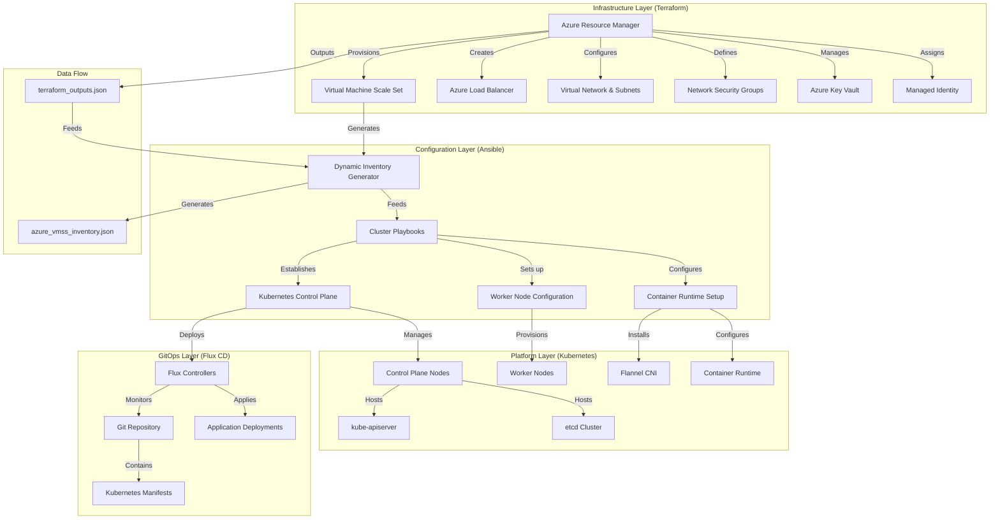
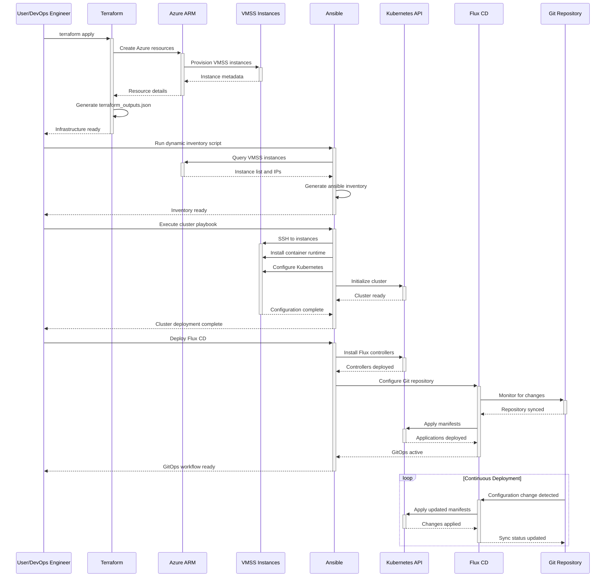

# 🏗️ System Architecture

## 📖 Overview

This document outlines the comprehensive architecture of the Azure VMSS Kubernetes Cluster with GitOps, a production-ready infrastructure solution that demonstrates enterprise-grade DevOps practices. The system implements a multi-layer automation approach, integrating Infrastructure as Code (Terraform), Configuration Management (Ansible), and Continuous Deployment (GitOps) to deliver a scalable, secure, and maintainable Kubernetes platform on Azure.

---

## 🏛️ High-Level Architecture



The architecture follows a layered approach where each layer has specific responsibilities and clear interfaces with adjacent layers, ensuring separation of concerns and maintainability.

---

## 🧩 Core Components

### Infrastructure Layer (Terraform)
- **Purpose**: Automated provisioning of Azure cloud resources with infrastructure as code
- **Technology**: Terraform 1.0+, Azure Resource Manager, Azure Provider
- **Location**: `terraform/` directory
- **Responsibilities**:
  - Provision Azure Virtual Machine Scale Set with Ubuntu 22.04 LTS
  - Configure Azure Load Balancer for high availability and traffic distribution
  - Set up Virtual Network with proper subnetting and security groups
  - Manage SSH key generation and secure storage in Azure Key Vault
  - Establish managed identity for secure Azure resource access
- **Interfaces**: Azure Resource Manager API, Terraform state management, outputs to Ansible

### Configuration Management Layer (Ansible)
- **Purpose**: Systematic configuration and setup of Kubernetes cluster components
- **Technology**: Ansible 2.9+, Python 3.8+, Dynamic Inventory
- **Location**: `ansible/` directory  
- **Responsibilities**:
  - Generate dynamic inventory from VMSS instances using Azure APIs
  - Configure container runtime (Containerd) on all nodes
  - Deploy Kubernetes control plane components (API server, scheduler, controller manager, etcd)
  - Set up worker nodes and join them to the cluster
  - Install and configure Flannel CNI for pod networking
  - Prepare cluster for GitOps workflow integration
- **Interfaces**: Azure VMSS API, SSH connections to instances, Kubernetes API

### Platform Layer (Kubernetes)
- **Purpose**: Container orchestration platform providing scalable application runtime
- **Technology**: Kubernetes 1.24+, Containerd 1.6+, Flannel CNI
- **Location**: Deployed on VMSS instances
- **Responsibilities**:
  - Provide container orchestration and scheduling
  - Manage pod lifecycle and resource allocation
  - Handle service discovery and load balancing
  - Implement network policies and security boundaries
  - Support persistent storage and stateful applications
  - Enable horizontal pod autoscaling and cluster scaling
- **Interfaces**: kubectl API, container runtime interface, network plugins

### GitOps Layer (Flux CD)
- **Purpose**: Continuous deployment and configuration management through Git workflows
- **Technology**: Flux CD 2.0, Git repositories, Kubernetes Custom Resources
- **Location**: `gitops/` directory and deployed controllers
- **Responsibilities**:
  - Monitor Git repositories for configuration changes
  - Automatically apply Kubernetes manifests and configurations
  - Detect and remediate configuration drift
  - Manage application lifecycle through declarative configuration
  - Provide rollback and version control for deployments
  - Enable multi-environment promotion workflows
- **Interfaces**: Git repositories, Kubernetes API, webhook integrations

---

## 📊 Data Models & Schema

```mermaid
erDiagram
    TERRAFORM_STATE ||--o{ AZURE_RESOURCES : "manages"
    AZURE_RESOURCES ||--|| VMSS_INSTANCES : "contains"
    VMSS_INSTANCES ||--o{ ANSIBLE_INVENTORY : "generates"
    ANSIBLE_INVENTORY ||--|| KUBERNETES_NODES : "configures"
    KUBERNETES_NODES ||--o{ KUBERNETES_CLUSTER : "forms"
    KUBERNETES_CLUSTER ||--|| FLUX_CONTROLLERS : "hosts"
    FLUX_CONTROLLERS ||--o{ GIT_REPOSITORIES : "monitors"
    GIT_REPOSITORIES ||--o{ APPLICATION_MANIFESTS : "contains"
    
    TERRAFORM_STATE {
        string resource_group_name
        string vmss_name
        string load_balancer_ip
        string vnet_id
        string ssh_key_vault_uri
    }
    
    VMSS_INSTANCES {
        string instance_id
        string private_ip
        string public_ip
        string availability_zone
        string instance_state
    }
    
    KUBERNETES_NODES {
        string node_name
        string node_role
        string kubelet_version
        string container_runtime
        string node_status
    }
    
    FLUX_CONTROLLERS {
        string controller_name
        string namespace
        string git_repository_url
        string sync_interval
        string last_sync_time
    }
```



### Key Data Entities
- **Infrastructure State**: Terraform state containing Azure resource metadata and configuration
- **VMSS Instance Data**: Dynamic inventory of virtual machine instances with network and status information
- **Kubernetes Cluster State**: Node registry, pod distribution, and cluster health metrics
- **GitOps Configuration**: Repository mappings, sync status, and deployment tracking

### Relationships
- Terraform State → VMSS Instances: Infrastructure definitions create and manage virtual machine instances
- VMSS Instances → Kubernetes Nodes: Virtual machines are configured as Kubernetes cluster nodes
- Kubernetes Cluster → Flux Controllers: GitOps controllers are deployed as cluster workloads
- Git Repositories → Application Manifests: Version-controlled configurations drive deployment automation

---

## 🔄 Data Flow & Interactions



### Request/Response Flow
1. **Infrastructure Provisioning**: User initiates Terraform deployment, creating Azure resources and VMSS instances
2. **Dynamic Inventory Generation**: Ansible queries Azure APIs to discover VMSS instances and generate inventory
3. **Cluster Configuration**: Ansible connects to instances via SSH and configures Kubernetes components
4. **GitOps Setup**: Flux CD controllers are deployed and configured to monitor Git repositories
5. **Continuous Deployment**: Git changes trigger automatic deployment through Flux CD controllers
6. **Monitoring & Reconciliation**: System continuously monitors for configuration drift and applies corrections

---

## 🚀 Deployment & Environment

### Development Environment
- **Platform**: Linux/macOS with Azure CLI, Terraform, Ansible, and kubectl installed
- **Dependencies**: Azure subscription, SSH key pair, Git repository access
- **Setup**: Local development with remote Azure infrastructure deployment

### Production Considerations
- **Scalability**: VMSS auto-scaling based on CPU/memory metrics, horizontal pod autoscaling
- **Performance**: Optimized container runtime, efficient CNI networking, resource request/limit tuning
- **Monitoring**: Azure Monitor integration, Kubernetes metrics server, Flux CD observability

### Configuration Management
- **Environment Variables**: Azure subscription ID, resource group naming, cluster configuration
- **Secrets**: SSH keys stored in Azure Key Vault, Kubernetes secrets for sensitive data
- **Feature Flags**: Conditional resource deployment, optional component installation

---

## 🔒 Security Architecture

### Authentication & Authorization
- **Authentication**: Azure Managed Identity for service-to-service authentication
- **Authorization**: Azure RBAC for resource access, Kubernetes RBAC for cluster operations
- **Session Management**: Token-based authentication with automatic rotation

### Data Protection
- **Encryption**: Azure disk encryption, Kubernetes secrets encryption at rest
- **Input Validation**: Terraform variable validation, Ansible parameter checking
- **Data Privacy**: Network isolation, private endpoints, secure communication channels

### Security Measures
- **Network Security**: NSG rules for traffic filtering, VNet isolation, private cluster endpoints
- **Identity Management**: Managed service identity, least privilege access principles
- **Secret Management**: Azure Key Vault integration, secure SSH key distribution
- **Compliance**: Security scanning, policy enforcement, audit logging

---

## ⚡ Error Handling & Resilience

### Error Management Strategy
- **Error Detection**: Terraform validation, Ansible task failures, Kubernetes health checks
- **Error Reporting**: Comprehensive logging across all layers, centralized log aggregation
- **Error Recovery**: Terraform state recovery, Ansible retry mechanisms, Kubernetes self-healing

### Resilience Patterns
- **Infrastructure Resilience**: Multi-zone deployment, load balancer health checks, VMSS auto-recovery
- **Application Resilience**: Pod restart policies, health probes, resource limits
- **GitOps Resilience**: Drift detection, automatic reconciliation, rollback capabilities

---

## 🎯 Design Decisions & Trade-offs

### Key Architectural Decisions

1. **VMSS vs AKS**
   - **Decision**: Use Azure VMSS with custom Kubernetes installation
   - **Rationale**: Full control over cluster configuration, cost optimization, learning objectives
   - **Alternatives**: Azure Kubernetes Service (AKS), self-managed VMs
   - **Trade-offs**: Gained control and cost savings, increased operational complexity

2. **Ansible vs Cloud-Init**
   - **Decision**: Use Ansible for configuration management
   - **Rationale**: Idempotent operations, complex orchestration capabilities, role reusability
   - **Alternatives**: Cloud-init scripts, Azure VM extensions, custom scripts
   - **Trade-offs**: Gained flexibility and maintainability, added complexity and dependencies

3. **Flannel vs Calico CNI**
   - **Decision**: Use Flannel for container networking
   - **Rationale**: Simplicity, proven stability, sufficient for most use cases
   - **Alternatives**: Calico, Cilium, Azure CNI
   - **Trade-offs**: Gained simplicity and reliability, limited advanced networking features

4. **Flux CD vs ArgoCD**
   - **Decision**: Use Flux CD for GitOps workflow
   - **Rationale**: Native Kubernetes integration, lightweight, strong Git-centric approach
   - **Alternatives**: ArgoCD, Jenkins, Azure DevOps
   - **Trade-offs**: Gained simplicity and Git integration, limited UI and complex workflow features

### Known Limitations
- **Single Region Deployment**: Currently limited to single Azure region deployment
- **Manual Scaling**: VMSS scaling requires manual intervention or external automation
- **Basic Monitoring**: Limited observability compared to managed Kubernetes services
- **Network Policy**: Basic networking without advanced security policies

### Future Considerations
- **Multi-Region Support**: Cross-region deployment and disaster recovery
- **Advanced Monitoring**: Prometheus, Grafana, and comprehensive observability stack
- **Service Mesh**: Istio or Linkerd for advanced traffic management and security
- **Policy Engine**: Open Policy Agent (OPA) for governance and compliance
- **Cost Optimization**: Spot instances, scheduled scaling, resource optimization

---

## 📁 Directory Structure & Organization

```
azure_vmss_cluster/
├── terraform/                    # Infrastructure as Code layer
│   ├── main.tf                  # Core Azure resource definitions
│   ├── variables.tf             # Input variables and configuration
│   ├── outputs.tf               # Resource metadata export
│   ├── ssh.tf                   # SSH key management automation
│   ├── providers.tf             # Terraform provider configuration
│   └── scripts/                 # Helper scripts and utilities
├── ansible/                     # Configuration management layer
│   ├── playbook.yml             # Master playbook orchestration
│   ├── azure_vmss_inventory.py  # Dynamic inventory generation
│   ├── requirements.yml         # Ansible collections and dependencies
│   └── roles/                   # Custom Ansible roles
│       ├── common/              # Base system configuration
│       ├── containerd/          # Container runtime setup
│       ├── kubernetes/          # Cluster deployment roles
│       └── flux/                # GitOps setup roles
├── gitops/                      # GitOps workflow definitions
│   ├── flux-config/             # Flux CD configuration
│   ├── clusters/                # Environment-specific configs
│   └── manifests/               # Kubernetes application manifests
├── init.sh                      # Master deployment orchestration
├── README.md                    # Project documentation
├── ARCHITECTURE.md              # System architecture (this file)
├── SKILLS-INDEX.md              # Skills and competencies mapping
├── AUTHORS.md                   # Contributors and acknowledgments
└── LICENSE.txt                  # License terms and conditions
```

### Organization Principles
- **Layer Separation**: Clear boundaries between infrastructure, configuration, and application layers
- **Component Isolation**: Each directory contains related files with specific responsibilities
- **Configuration Management**: Centralized configuration with environment-specific overrides
- **Documentation Proximity**: Documentation co-located with relevant code components

---

## 🔗 External Dependencies

| Dependency | Purpose | Version | Documentation |
|------------|---------|---------|---------------|
| Terraform | Infrastructure provisioning and state management | 1.0+ | [Terraform Documentation](https://www.terraform.io/docs) |
| Azure Provider | Terraform integration with Azure Resource Manager | ~>3.0 | [Azure Provider Docs](https://registry.terraform.io/providers/hashicorp/azurerm/latest/docs) |
| Ansible | Configuration management and automation | 2.9+ | [Ansible Documentation](https://docs.ansible.com/) |
| Azure Collection | Ansible modules for Azure resource management | Latest | [Azure Collection Docs](https://docs.ansible.com/ansible/latest/collections/azure/azcollection/) |
| Kubernetes | Container orchestration platform | 1.24+ | [Kubernetes Documentation](https://kubernetes.io/docs/) |
| Containerd | Container runtime implementation | 1.6+ | [Containerd Documentation](https://containerd.io/docs/) |
| Flannel | Container networking interface | Latest | [Flannel Documentation](https://github.com/flannel-io/flannel) |
| Flux CD | GitOps continuous deployment | 2.0+ | [Flux CD Documentation](https://fluxcd.io/docs/) |

---

## 📚 References
- [Project README](README.md)
- [Skills Documentation](SKILLS-INDEX.md)
- [Contributors Guide](AUTHORS.md)
- [Azure VMSS Documentation](https://docs.microsoft.com/en-us/azure/virtual-machine-scale-sets/)
- [Kubernetes Cluster Administration](https://kubernetes.io/docs/concepts/cluster-administration/)
- [GitOps Principles](https://www.gitops.tech/)
- [Infrastructure as Code Best Practices](https://www.terraform.io/docs/cloud/guides/recommended-practices/)