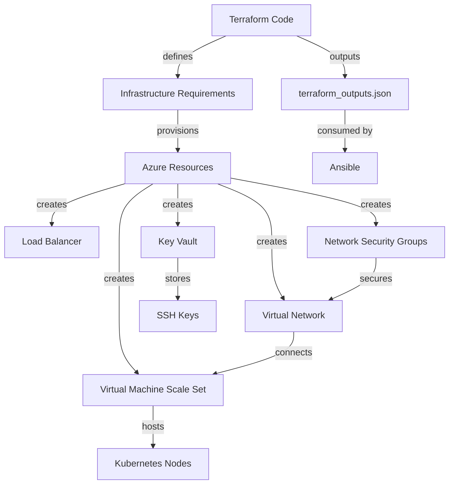

# Terraform Architecture

This document describes the architecture of the Terraform infrastructure components for the Azure VMSS Kubernetes cluster.

## Architecture Diagram

## Component Description

### Infrastructure Resources
- **Virtual Machine Scale Set (VMSS)**: Scalable compute infrastructure running Ubuntu 22.04 LTS that hosts the Kubernetes cluster
- **Load Balancer**: Distributes traffic to VMSS instances and provides a public endpoint for the cluster
- **Virtual Network**: Networking foundation with proper subnetting for node-to-node communication
- **Network Security Groups**: Firewall rules that control inbound and outbound traffic
- **Key Vault**: Secure storage for SSH keys and other sensitive information

### Security Components
- **Managed Identities**: System-assigned identities for VMSS instances to access Azure resources securely
- **SSH Key Generation**: Automated generation and secure storage of SSH keys
- **RBAC Assignments**: Proper role assignments for controlled access to resources

### Data Flow
1. **Infrastructure Definition**: Terraform code defines the desired state of infrastructure
2. **Resource Provisioning**: Azure Provider creates resources according to specification
3. **Key Management**: SSH keys are generated and stored in Key Vault
4. **Output Generation**: Resource information is exported to terraform_outputs.json
5. **Consumption by Ansible**: Output data is used to build dynamic inventory for configuration

### Integration Points
- **Output to Ansible**: terraform_outputs.json provides resource information to Ansible
- **SSH Key Access**: Generated SSH keys are used by Ansible for node access
- **VM Connection**: VMSS instances are prepared to receive Ansible configuration