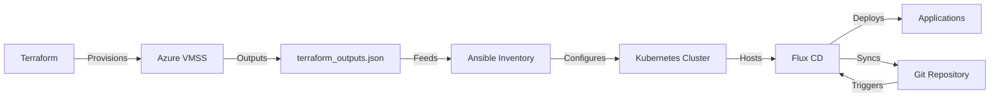

<p align="center">
  
  
  
  
  
</p>

<div align="center">
  <h1>🚀 Azure VMSS Kubernetes Cluster with GitOps</h1>
  <p><em>Production-ready infrastructure-as-code solution for enterprise Kubernetes deployment</em></p>
</div>

---

## 📋 Table of Contents
- [📖 Overview](#-overview)
- [🎯 Learning Objectives](#-learning-objectives)
- [🛠️ Tech Stack](#️-tech-stack)
- [📁 Project Structure](#-project-structure)
- [🚀 Getting Started](#-getting-started)
- [💡 Usage](#-usage)
- [🏆 Key Features](#-key-features)
- [🔧 Deployment Workflow](#-deployment-workflow)
- [🔒 Security Features](#-security-features)
- [📚 Resources](#-resources)
- [👥 Contributors](#-contributors)

## 📖 Overview

This project delivers a comprehensive solution for deploying and managing production-ready Kubernetes clusters on Azure Virtual Machine Scale Sets (VMSS) with integrated GitOps workflows. It demonstrates enterprise-grade DevOps practices through multi-layer automation, combining Infrastructure as Code (Terraform), Configuration Management (Ansible), and Continuous Deployment (Flux CD).

The solution addresses real-world challenges in cloud infrastructure management, providing automated provisioning, security hardening, and continuous deployment capabilities. It serves as a complete reference implementation for organizations seeking to adopt cloud-native infrastructure patterns with Azure.

## 🎯 Learning Objectives

Upon completion, you will have mastered:

- **Advanced Infrastructure as Code**: Design and implement complex Azure infrastructure using Terraform
- **Multi-Layer Automation**: Orchestrate Terraform, Ansible, and GitOps workflows seamlessly
- **Production Kubernetes Deployment**: Configure and secure enterprise-grade Kubernetes clusters
- **GitOps Implementation**: Establish continuous deployment pipelines with Flux CD
- **Azure Cloud Architecture**: Design scalable, secure cloud infrastructure on Azure
- **DevOps Engineering**: Apply advanced automation and integration patterns
- **Security Best Practices**: Implement managed identity, network security, and SSH key automation
- **Configuration Management**: Develop sophisticated Ansible playbooks and dynamic inventories

## 🛠️ Tech Stack

**Core Technologies:**
- **Terraform 1.0+**: Infrastructure provisioning and state management
- **Ansible 2.9+**: Configuration management and automation
- **Kubernetes 1.24+**: Container orchestration platform
- **Azure VMSS**: Scalable virtual machine infrastructure

**Development Tools:**
- **Azure CLI**: Cloud resource management
- **Flux CD 2.0**: GitOps continuous deployment
- **Python 3.8+**: Automation scripting and dynamic inventory
- **Containerd 1.6+**: Container runtime
- **Flannel CNI**: Kubernetes networking

**Infrastructure Components:**
- **Azure Provider ~>3.0**: Terraform Azure integration
- **Azure Key Vault**: Secure secrets management
- **Azure Load Balancer**: Traffic distribution and high availability
- **Azure Virtual Network**: Network isolation and security
- **Azure Resource Manager**: Resource lifecycle management

## 📁 Project Structure

```
azure_vmss_cluster/
├── terraform/                    # Infrastructure as Code layer
│   ├── main.tf                  # Core Azure resource definitions
│   ├── variables.tf             # Configurable parameters
│   ├── outputs.tf               # Resource metadata export
│   ├── ssh.tf                   # SSH key automation
│   └── providers.tf             # Terraform provider configuration
├── ansible/                     # Configuration management layer
│   ├── playbook.yml             # Master playbook for cluster setup
│   ├── azure_vmss_inventory.py  # Dynamic inventory generation
│   ├── requirements.yml         # Ansible collections and roles
│   └── roles/                   # Custom Ansible roles
├── gitops/                      # GitOps workflow definitions
│   ├── flux-config/             # Flux CD configuration
│   └── manifests/               # Kubernetes application manifests
├── init.sh                      # Master deployment script
├── README.md                    # Project documentation
├── ARCHITECTURE.md              # System architecture guide
├── SKILLS-INDEX.md              # Skills and competencies mapping
└── AUTHORS.md                   # Contributors and acknowledgments
```

## 🚀 Getting Started

### Prerequisites

**System Requirements:**
- Azure subscription with Contributor access
- Terraform 1.0+ installed and configured
- Ansible 2.9+ with Azure collections
- Azure CLI configured with authentication
- kubectl and flux CLI tools
- Git version control system

**Knowledge Prerequisites:**
- Understanding of Kubernetes architecture
- Familiarity with Infrastructure as Code concepts
- Basic experience with Azure cloud services
- Understanding of CI/CD and GitOps principles

### Installation

```bash
# Clone the repository
git clone https://github.com/yungryce/azure_vmss_cluster.git
cd azure_vmss_cluster

# Set up Azure authentication
az login
az account set --subscription "your-subscription-id"

# Initialize Terraform
cd terraform
terraform init

# Review and customize variables
cp terraform.tfvars.example terraform.tfvars
# Edit terraform.tfvars with your specific values

# Deploy infrastructure
terraform plan
terraform apply
```

### Quick Start Deployment

```bash
# Use the master deployment script
./init.sh

# Or deploy step by step:
# 1. Deploy infrastructure
cd terraform && terraform apply -auto-approve

# 2. Generate dynamic inventory
cd ../ansible
python azure_vmss_inventory.py

# 3. Configure cluster
ansible-playbook -i azure_vmss_inventory.json playbook.yml

# 4. Set up GitOps
ansible-playbook -i azure_vmss_inventory.json gitops/setup-flux.yml
```

## 💡 Usage

### Infrastructure Management

```bash
# View infrastructure status
terraform show

# Update infrastructure
terraform plan
terraform apply

# Destroy infrastructure
terraform destroy
```

### Cluster Operations

```bash
# Check cluster status
kubectl get nodes
kubectl get pods --all-namespaces

# Access cluster dashboard
kubectl proxy

# Monitor GitOps sync
flux get sources git
flux get kustomizations
```

### Application Deployment

```bash
# Deploy via GitOps
git add manifests/your-app.yaml
git commit -m "Deploy new application"
git push origin main

# Monitor deployment
kubectl get pods -n your-namespace
flux logs --follow
```

## 🏆 Key Features

### Infrastructure Automation
- **Automated VMSS Provisioning**: Scalable virtual machine infrastructure with load balancing
- **Network Security**: Comprehensive NSG rules and VNet isolation
- **SSH Key Management**: Automated key generation and secure storage in Key Vault
- **Managed Identity Integration**: Credential-free authentication to Azure resources

### Configuration Management
- **Dynamic Inventory**: Automatic discovery and configuration of VMSS instances
- **Role-Based Playbooks**: Modular Ansible roles for different components
- **Idempotent Operations**: Reliable, repeatable configuration management
- **Multi-Node Coordination**: Coordinated setup across control plane and worker nodes

### Container Platform
- **Production Kubernetes**: Enterprise-grade cluster with security hardening
- **CNI Integration**: Flannel networking for pod-to-pod communication
- **Container Runtime**: Containerd with optimized configuration
- **Cluster Monitoring**: Built-in observability and logging

### GitOps Workflow
- **Flux CD Integration**: Automated continuous deployment from Git repositories
- **Declarative Configuration**: Infrastructure and applications managed as code
- **Automatic Reconciliation**: Self-healing deployments and configuration drift detection
- **Multi-Environment Support**: Configurable deployment targets and promotion workflows

## 🔧 Deployment Workflow



1. **Infrastructure Provisioning**: Terraform creates Azure VMSS, networking, and security resources
2. **Dynamic Inventory**: Python script generates Ansible inventory from VMSS instances
3. **Cluster Configuration**: Ansible playbooks configure Kubernetes on all nodes
4. **GitOps Setup**: Flux CD is installed and configured for continuous deployment
5. **Application Deployment**: Applications are deployed and managed through Git workflows

## 🔒 Security Features

- **Managed Identity Authentication**: Eliminates credential management overhead
- **Network Segmentation**: VNet isolation with controlled ingress/egress rules
- **SSH Key Automation**: Secure key generation and Key Vault storage
- **RBAC Integration**: Role-based access control throughout the stack
- **Secure Communication**: TLS encryption for all inter-component communication
- **Secret Management**: Azure Key Vault integration for sensitive data

## 📚 Resources

### Project Documentation
- [System Architecture](ARCHITECTURE.md) - Detailed technical architecture
- [Skills Documentation](SKILLS-INDEX.md) - Comprehensive skills mapping
- [Contributors Guide](AUTHORS.md) - Contribution guidelines and acknowledgments

### External References
- [Terraform Azure Provider Documentation](https://registry.terraform.io/providers/hashicorp/azurerm/latest/docs)
- [Ansible Azure Collections](https://docs.ansible.com/ansible/latest/collections/azure/azcollection/)
- [Kubernetes Documentation](https://kubernetes.io/docs/)
- [Flux CD Documentation](https://fluxcd.io/docs/)
- [Azure VMSS Documentation](https://docs.microsoft.com/en-us/azure/virtual-machine-scale-sets/)

## 👥 Contributors

**Primary Author:** Chigbu Joshua ([@yungryce](https://github.com/yungryce))

For detailed contributor information and guidelines, see [AUTHORS.md](AUTHORS.md).

---

<div align="center">
  <p><strong>🎯 Demonstrating Advanced DevOps Engineering Excellence</strong></p>
  <p><em>Infrastructure as Code • Configuration Management • Container Orchestration • GitOps</em></p>
</div>