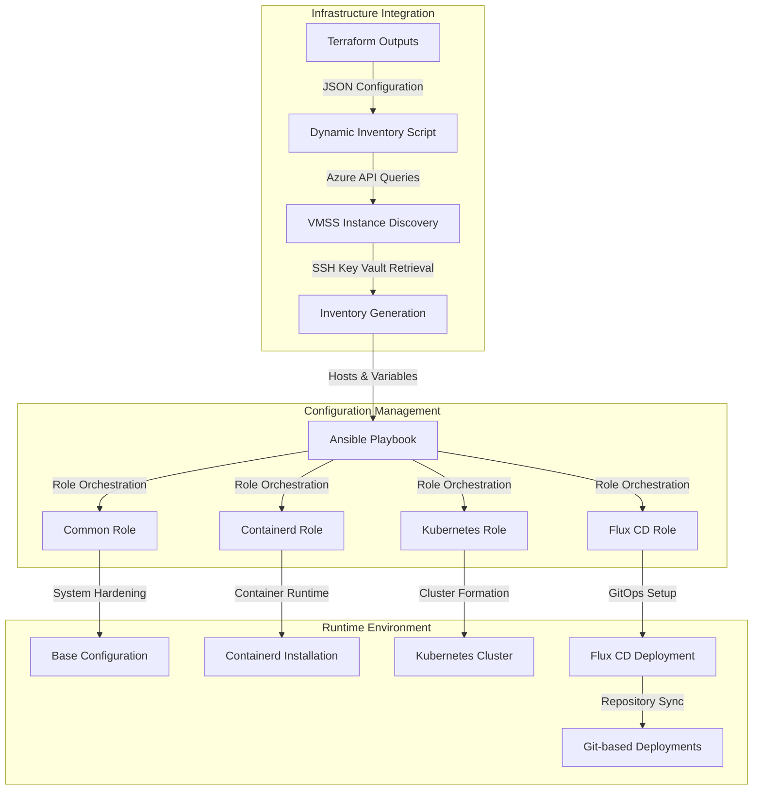
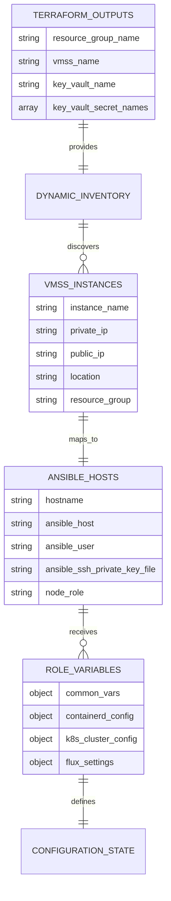
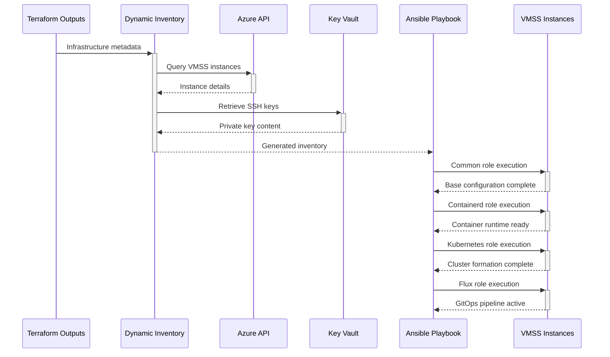

# 🏗️ System Architecture

## 📖 Overview
The Ansible configuration management system provides automated infrastructure provisioning and cluster orchestration for Azure VMSS-based Kubernetes deployments. This system bridges raw Azure infrastructure with production-ready Kubernetes clusters through idempotent, role-based configuration management and GitOps integration.

---

## 🏛️ High-Level Architecture



The architecture implements a three-tier approach: Infrastructure Integration retrieves and processes Azure resources, Configuration Management applies idempotent system configurations, and Runtime Environment provides the operational Kubernetes platform with GitOps capabilities.

---

## 🧩 Core Components

### Dynamic Inventory Management
- **Purpose**: Automated discovery and configuration of Azure VMSS instances for Ansible orchestration
- **Technology**: Python 3.8+, Azure CLI, JSON processing
- **Location**: `azure_vmss_inventory.py`
- **Responsibilities**:
  - Parse Terraform output files for infrastructure metadata
  - Query Azure API for real-time VMSS instance information
  - Retrieve SSH private keys from Azure Key Vault
  - Generate Ansible inventory with host groupings and variables
  - Assign master/worker roles based on instance ordering
- **Interfaces**: Consumes Terraform JSON outputs, Azure REST API, produces Ansible inventory JSON

### Role-Based Configuration Engine
- **Purpose**: Modular, idempotent system configuration through specialized Ansible roles
- **Technology**: Ansible 2.9+, YAML, Jinja2 templating
- **Location**: `playbook.yml`, `roles/*/`
- **Responsibilities**:
  - Orchestrate multi-role deployment sequences
  - Ensure idempotent configuration application
  - Handle dependency management between roles
  - Provide rollback and error recovery mechanisms
  - Manage configuration validation and testing
- **Interfaces**: Processes dynamic inventory, applies system configurations, integrates with external services

### System Foundation Layer (Common Role)
- **Purpose**: Baseline system configuration and security hardening for all cluster nodes
- **Technology**: Ubuntu 22.04 LTS, systemd, APT package management
- **Location**: `roles/common/`
- **Responsibilities**:
  - Package installation and system updates
  - SSH configuration and security hardening
  - Firewall rules and network security
  - User account management
  - System monitoring setup
- **Interfaces**: Configures OS-level services, prepares environment for container runtime

### Container Runtime Layer (Containerd Role)
- **Purpose**: Container runtime installation and configuration for Kubernetes nodes
- **Technology**: Containerd 1.6+, CNI plugins, systemd services
- **Location**: `roles/containerd/`
- **Responsibilities**:
  - Containerd installation and configuration
  - CNI plugin setup for network management
  - Container image registry configuration
  - Runtime security policies
  - Performance tuning and optimization
- **Interfaces**: Provides container runtime for Kubernetes, integrates with CNI networking

### Kubernetes Orchestration Layer (K8s Role)
- **Purpose**: Kubernetes cluster initialization and node configuration
- **Technology**: Kubernetes 1.24+, kubeadm, kubelet, kubectl
- **Location**: `roles/k8s/`
- **Responsibilities**:
  - Kubernetes component installation
  - Cluster initialization and node joining
  - Network plugin deployment (Flannel CNI)
  - RBAC and security configuration
  - Cluster validation and health checks
- **Interfaces**: Manages Kubernetes API server, coordinates with container runtime, prepares for GitOps

### GitOps Deployment Layer (Flux Role)
- **Purpose**: Continuous deployment and GitOps workflow implementation
- **Technology**: Flux CD 2.0, Git repositories, Kubernetes controllers
- **Location**: `roles/flux/`
- **Responsibilities**:
  - Flux CD installation and configuration
  - Git repository connection setup
  - Automated deployment pipeline configuration
  - Secret management integration
  - Monitoring and alerting setup
- **Interfaces**: Watches Git repositories, deploys to Kubernetes cluster, manages application lifecycle

---

## 📊 Data Models & Schema



### Key Data Entities
- **Terraform Outputs**: Infrastructure metadata consumed from IaC deployment
- **VMSS Instances**: Real-time Azure virtual machine scale set instance data
- **Ansible Hosts**: Processed inventory entries with connection and role information
- **Role Variables**: Configuration parameters specific to each Ansible role
- **Configuration State**: Current and desired system configuration states

### Relationships
- Terraform Outputs → Dynamic Inventory: Provides infrastructure context and authentication
- VMSS Instances → Ansible Hosts: Maps Azure resources to configuration targets
- Ansible Hosts → Role Variables: Applies role-specific configurations per host

---

## 🔄 Data Flow & Interactions



### Request/Response Flow
1. **Infrastructure Discovery**: Dynamic inventory script reads Terraform outputs and queries Azure API for current VMSS state
2. **Authentication Setup**: SSH private keys are retrieved from Azure Key Vault and configured for secure access
3. **Inventory Generation**: Ansible inventory is built with host groupings, variables, and role assignments
4. **Sequential Role Execution**: Roles are applied in dependency order ensuring proper system layering
5. **Validation & Health Checks**: Each role validates successful completion before proceeding to next stage

---

## 🚀 Deployment & Environment

### Development Environment
- **Platform**: Ubuntu 22.04 LTS (development), Azure VMSS (target)
- **Dependencies**: Python 3.8+, Ansible 2.9+, Azure CLI, SSH client
- **Setup**: Terraform infrastructure must be deployed first, Azure authentication configured

### Production Considerations
- **Scalability**: Dynamic inventory automatically scales with VMSS instance changes
- **Performance**: Parallel execution across nodes with role-based batching
- **Monitoring**: Integrated logging through systemd and Kubernetes native monitoring

### Configuration Management
- **Environment Variables**: Azure credentials, Terraform output paths, SSH configurations
- **Secrets**: SSH private keys stored in Azure Key Vault, Flux secrets encrypted in Git
- **Feature Flags**: Role enablement through playbook variables and conditional execution

---

## 🔒 Security Architecture

### Authentication & Authorization
- **Authentication**: Azure service principal for API access, SSH key-based node authentication
- **Authorization**: RBAC through Azure IAM for resource access, Kubernetes RBAC for cluster operations
- **Session Management**: SSH connection pooling with secure key rotation capabilities

### Data Protection
- **Encryption**: SSH connections encrypted in transit, Kubernetes secrets encrypted at rest
- **Input Validation**: Ansible variable validation and type checking
- **Data Privacy**: Sensitive configuration stored in Azure Key Vault with access logging

### Security Measures
- **Network Security**: Firewall rules configured through common role, network policies in Kubernetes
- **System Hardening**: Security updates, service account restrictions, minimal privilege principles
- **Secret Management**: Azure Key Vault integration with automatic key rotation

---

## ⚡ Error Handling & Resilience

### Error Management Strategy
- **Error Detection**: Ansible task failure detection with detailed logging and rollback triggers
- **Error Reporting**: Centralized logging through Azure Monitor and Kubernetes event streams
- **Error Recovery**: Idempotent role execution enables safe retry operations and partial failure recovery

### Resilience Patterns
- **Circuit Breaker**: Task timeout configurations prevent infinite hanging operations
- **Retry Logic**: Automatic retry for transient failures with exponential backoff
- **Health Checks**: Continuous validation of service availability and cluster health

---

## 🎯 Design Decisions & Trade-offs

### Key Architectural Decisions
1. **Dynamic Inventory vs Static Configuration**
   - **Decision**: Implemented Python-based dynamic inventory script
   - **Rationale**: Enables automatic scaling response and real-time Azure integration
   - **Alternatives**: Static inventory files, Ansible Azure dynamic inventory plugin
   - **Trade-offs**: Added complexity for improved flexibility and automation

2. **Role-Based Modular Architecture**
   - **Decision**: Separated concerns into distinct Ansible roles with clear dependencies
   - **Rationale**: Improves maintainability, testing, and selective deployment capabilities
   - **Alternatives**: Monolithic playbook, task-based organization
   - **Trade-offs**: Increased file structure complexity for better modularity and reusability

3. **GitOps Integration with Flux CD**
   - **Decision**: Implemented Flux CD for continuous deployment automation
   - **Rationale**: Enables declarative, Git-driven deployment workflows with audit trails
   - **Alternatives**: Direct kubectl deployments, Helm-based deployments, ArgoCD
   - **Trade-offs**: Additional learning curve for comprehensive GitOps capabilities

### Known Limitations
- **Azure Dependency**: Requires active Azure subscription and proper IAM permissions
- **Network Connectivity**: Assumes reliable internet connectivity for package installations and Git synchronization
- **Scale Limitations**: Performance degrades with very large VMSS deployments (>100 instances)

### Future Considerations
- **Multi-Cloud Support**: Abstract cloud provider interactions for AWS/GCP compatibility
- **Advanced Monitoring**: Integration with Prometheus/Grafana for comprehensive observability
- **Blue-Green Deployments**: Enhanced deployment strategies for zero-downtime updates

---

## 📁 Directory Structure & Organization

```
ansible/
├── playbook.yml              # Main orchestration playbook
├── azure_vmss_inventory.py   # Dynamic inventory script
├── requirements.yml          # Ansible Galaxy dependencies
├── azure_vmss_inventory.json # Generated inventory cache
├── roles/                    # Modular configuration roles
│   ├── common/               # Base system configuration
│   │   ├── tasks/main.yml    # System setup tasks
│   │   ├── handlers/main.yml # Service restart handlers
│   │   └── defaults/main.yml # Default variables
│   ├── containerd/           # Container runtime setup
│   │   ├── tasks/main.yml    # Containerd installation
│   │   └── templates/        # Configuration templates
│   ├── k8s/                  # Kubernetes cluster setup
│   │   ├── tasks/main.yml    # Cluster initialization
│   │   ├── templates/        # Kubernetes manifests
│   │   └── vars/main.yml     # Cluster configuration
│   ├── flux/                 # GitOps deployment setup
│   │   ├── tasks/main.yml    # Flux CD installation
│   │   ├── vars/secrets.yml  # Encrypted secrets
│   │   └── templates/        # Flux configuration
│   └── docker/               # Alternative container runtime
└── README.md                 # Container documentation
```

### Organization Principles
- **Role Isolation**: Each role handles a specific system layer with clear boundaries
- **Template-Driven**: Configuration files generated from Jinja2 templates for flexibility
- **Variable Hierarchy**: Variables cascade from global defaults to role-specific overrides

---

## 🔗 External Dependencies

| Dependency | Purpose | Version | Documentation |
|------------|---------|---------|---------------|
| Ansible | Configuration management automation | 2.9+ | [Ansible Docs](https://docs.ansible.com/) |
| Azure CLI | Azure API interaction | 2.0+ | [Azure CLI Reference](https://docs.microsoft.com/en-us/cli/azure/) |
| Kubernetes | Container orchestration platform | 1.24+ | [Kubernetes Docs](https://kubernetes.io/docs/) |
| Containerd | Container runtime engine | 1.6+ | [Containerd Docs](https://containerd.io/docs/) |
| Flux CD | GitOps continuous deployment | 2.0+ | [Flux Documentation](https://fluxcd.io/docs/) |
| Flannel | Kubernetes network plugin | 0.20+ | [Flannel GitHub](https://github.com/flannel-io/flannel) |

---

## 📚 References
- [Project README](README.md)
- [Project Manifest](PROJECT-MANIFEST.md)
- [Parent Architecture](../ARCHITECTURE.md)
- [Terraform Integration](../terraform/README.md)