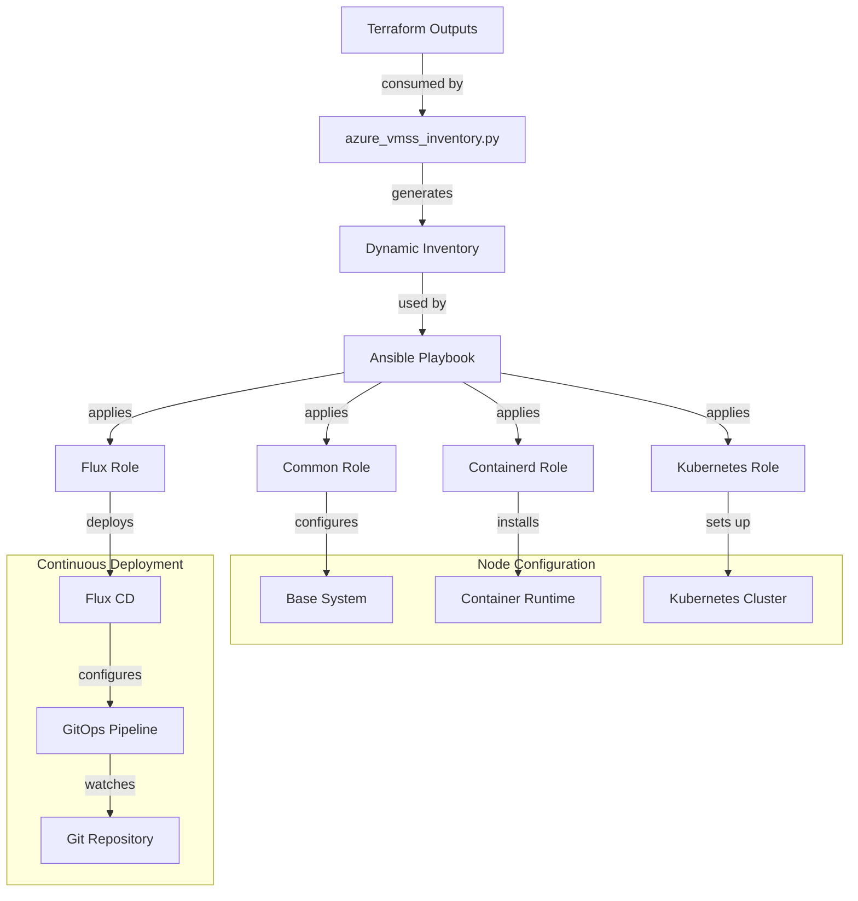

# Ansible Architecture

This document describes the architecture and workflow of the Ansible configuration management for the Azure VMSS Kubernetes cluster.

## Architecture Diagram

## Component Description

### Inventory Management
- **Dynamic Inventory Script**: Reads Terraform outputs and queries Azure API to build a structured inventory
- **Azure VMSS Integration**: Discovers VMSS instances and their private IPs
- **SSH Key Retrieval**: Securely fetches SSH private key from Azure Key Vault
- **Master/Worker Designation**: Assigns roles to nodes based on their position in the inventory

### Configuration Roles
- **Common Role**: Base system configuration including package management, security hardening, and SSH setup
- **Containerd Role**: Installation and configuration of the container runtime
- **Kubernetes Role**: Setup of Kubernetes components with proper node roles
  - Master node configuration (API server, scheduler, controller-manager)
  - Worker node configuration (kubelet, kube-proxy)
  - Cluster networking with Flannel CNI
- **Flux Role**: Installation and configuration of Flux CD for GitOps implementation

### GitOps Setup
- **Repository Structure**: Creation of a standardized GitOps repository structure
- **Flux Bootstrap**: Configuration of Flux to watch the Git repository
- **Manifest Management**: Organization of Kubernetes manifests for infrastructure and applications

### Workflow
1. **Inventory Generation**: Dynamic inventory script uses Terraform outputs to identify nodes
2. **Base Configuration**: All nodes receive common configuration
3. **Container Runtime**: Containerd is installed and configured on all nodes
4. **Kubernetes Deployment**:
   - Master node is initialized with control plane components
   - Worker nodes join the cluster with proper node configuration
   - Network plugin is deployed for pod-to-pod communication
5. **GitOps Implementation**:
   - Flux is installed in the Kubernetes cluster
   - Git repository is configured for continuous delivery
   - Initial manifests are applied to the cluster

### Security Considerations
- **SSH Hardening**: Secure SSH configuration on all nodes
- **Kubernetes RBAC**: Role-based access control for cluster resources
- **Network Policies**: Proper network segmentation for pod communication
- **Secret Management**: Secure handling of sensitive information like tokens and certificates