<p align="center">
  
  
  
  
  
</p>

<div align="center">
  <h1>⚙️ Ansible Configuration Management</h1>
  <p><em>Automated Kubernetes cluster configuration and GitOps deployment on Azure VMSS</em></p>
</div>

---

## 📋 Table of Contents
- [📖 Overview](#-overview)
- [🎯 Learning Objectives](#-learning-objectives)
- [🛠️ Tech Stack](#️-tech-stack)
- [📁 Project Structure](#-project-structure)
- [🚀 Getting Started](#-getting-started)
- [💡 Usage](#-usage)
- [🏆 Key Features](#-key-features)
- [🔧 Configuration Workflow](#-configuration-workflow)
- [👥 Contributors](#-contributors)

## 📖 Overview

This Ansible configuration management container provides automated Kubernetes cluster deployment and GitOps setup on Azure Virtual Machine Scale Set (VMSS) instances. It bridges the gap between raw infrastructure provisioned by Terraform and a production-ready Kubernetes platform with continuous deployment capabilities.

The solution demonstrates advanced configuration management patterns, including dynamic inventory generation, role-based system configuration, and multi-node cluster orchestration. It serves as the crucial automation layer that transforms infrastructure into a functional container orchestration platform.

## 🎯 Learning Objectives

Through this configuration management implementation, you will master:

- **Advanced Ansible Architecture**: Role-based configuration management with complex orchestration
- **Dynamic Inventory Management**: Azure API integration for automated instance discovery
- **Kubernetes Cluster Automation**: Complete cluster deployment from infrastructure to platform
- **GitOps Pipeline Integration**: Flux CD deployment and configuration automation
- **Multi-Node Coordination**: Master/worker node setup and cluster formation
- **Container Runtime Configuration**: Containerd installation and optimization
- **Network Overlay Setup**: Flannel CNI configuration and pod networking
- **Security Automation**: SSH key management and secure cluster communication

## 🛠️ Tech Stack

**Core Technologies:**
- **Ansible 2.9+**: Configuration management and automation orchestration
- **Python 3.8+**: Dynamic inventory scripting and Azure API integration
- **Azure CLI**: Cloud resource discovery and management
- **Kubernetes 1.24+**: Container orchestration platform deployment

**Container Platform Stack:**
- **Containerd 1.6+**: Container runtime installation and configuration
- **Flannel CNI**: Kubernetes networking overlay implementation
- **Flux CD 2.0**: GitOps continuous deployment setup
- **Ubuntu 22.04 LTS**: Target operating system configuration

**Integration Tools:**
- **Azure SDK for Python**: Azure resource management and Key Vault access
- **SSH Key Management**: Secure authentication and cluster communication
- **JSON Processing**: Terraform output consumption and data transformation

## 📁 Project Structure

```
ansible/
├── README.md                    # Container documentation (this file)
├── .repo-context.json          # Container metadata and context
├── ARCHITECTURE.md              # Configuration management architecture
├── PROJECT-MANIFEST.md         # Skills and competencies manifest
├── playbook.yml                 # Master playbook orchestrating all roles
├── azure_vmss_inventory.py      # Dynamic inventory generation script
├── requirements.yml             # Ansible collections and dependencies
├── azure_vmss_inventory.json    # Generated inventory (runtime artifact)
└── roles/                       # Ansible roles for component configuration
    ├── common/                  # Base system configuration
    ├── containerd/              # Container runtime setup
    ├── k8s/                     # Kubernetes cluster deployment
    ├── flux/                    # GitOps configuration
    └── docker/                  # Alternative container runtime (optional)
```

## 🚀 Getting Started

### Prerequisites

**System Requirements:**
- Python 3.8+ with Azure SDK packages
- Ansible 2.9+ with Azure collections
- Azure CLI configured with authentication
- SSH access to target VMSS instances

**Infrastructure Dependencies:**
- Terraform infrastructure deployment completed
- `terraform_outputs.json` file available
- Azure Key Vault with SSH keys stored
- VMSS instances running and accessible

### Installation

```bash
# Install Ansible collections and dependencies
ansible-galaxy install -r requirements.yml

# Verify Azure CLI authentication
az account show

# Generate dynamic inventory from VMSS
python azure_vmss_inventory.py

# Verify inventory generation
cat azure_vmss_inventory.json | jq '.'
```

### Configuration Validation

```bash
# Test Ansible connectivity to all hosts
ansible all -i azure_vmss_inventory.json -m ping

# Validate playbook syntax
ansible-playbook --syntax-check -i azure_vmss_inventory.json playbook.yml

# Run configuration in check mode (dry run)
ansible-playbook --check -i azure_vmss_inventory.json playbook.yml
```

## 💡 Usage

### Complete Cluster Deployment

```bash
# Deploy full Kubernetes cluster with GitOps
ansible-playbook -i azure_vmss_inventory.json playbook.yml

# Deploy specific roles only
ansible-playbook -i azure_vmss_inventory.json playbook.yml --tags "common,containerd"

# Target specific host groups
ansible-playbook -i azure_vmss_inventory.json playbook.yml --limit "master"
```

### Dynamic Inventory Management

```bash
# Regenerate inventory after VMSS scaling
python azure_vmss_inventory.py

# View inventory structure
ansible-inventory -i azure_vmss_inventory.json --list

# Test connectivity to new instances
ansible all -i azure_vmss_inventory.json -m setup
```

### Cluster Validation

```bash
# Verify Kubernetes cluster status
ansible master -i azure_vmss_inventory.json -a "kubectl get nodes"

# Check Flux CD deployment status
ansible master -i azure_vmss_inventory.json -a "flux get sources git"

# Validate pod networking
ansible master -i azure_vmss_inventory.json -a "kubectl get pods --all-namespaces"
```

## 🏆 Key Features

### Dynamic Infrastructure Integration
- **Terraform Output Consumption**: Automatic consumption of infrastructure metadata
- **Azure API Integration**: Real-time VMSS instance discovery and configuration
- **SSH Key Automation**: Secure key retrieval from Azure Key Vault
- **Scalability Awareness**: Automatic adaptation to VMSS scaling events

### Role-Based Configuration Management
- **Modular Architecture**: Separate roles for each configuration domain
- **Dependency Management**: Explicit role dependencies and execution order
- **Idempotent Operations**: Safe re-execution and configuration drift correction
- **Error Handling**: Comprehensive error detection and recovery mechanisms

### Kubernetes Platform Automation
- **Multi-Node Cluster Setup**: Automated master and worker node configuration
- **Container Runtime Optimization**: Containerd installation and performance tuning
- **Network Overlay Configuration**: Flannel CNI setup and pod networking
- **Security Hardening**: Cluster security configuration and RBAC setup

### GitOps Integration
- **Flux CD Deployment**: Automated GitOps controller installation
- **Repository Configuration**: Git repository connection and synchronization
- **Continuous Deployment**: Application deployment pipeline establishment
- **Configuration Management**: Declarative infrastructure and application management

## 🔧 Configuration Workflow



```mermaid
graph LR
    A[Terraform Outputs] -->|Read| B[Dynamic Inventory]
    B -->|Generate| C[Ansible Inventory]
    C -->|Configure| D[Base System]
    D -->|Install| E[Container Runtime]
    E -->|Deploy| F[Kubernetes Cluster]
    F -->|Setup| G[GitOps Pipeline]
    G -->|Enable| H[Continuous Deployment]
```

1. **Infrastructure Discovery**: Read Terraform outputs and query Azure APIs
2. **Dynamic Inventory Generation**: Create Ansible inventory with role assignments
3. **Base System Configuration**: Apply common system settings and security hardening
4. **Container Runtime Setup**: Install and configure Containerd with optimizations
5. **Kubernetes Deployment**: Deploy control plane and worker nodes with networking
6. **GitOps Configuration**: Install Flux CD and configure continuous deployment
7. **Validation & Testing**: Verify cluster functionality and GitOps operation

## 👥 Contributors

This configuration management container is part of the larger Azure VMSS Kubernetes Cluster project. For contributor information and guidelines, see the main [project contributors guide](../AUTHORS.md).

---

<div align="center">
  <p><strong>🎯 Demonstrating Advanced Configuration Management Excellence</strong></p>
  <p><em>Ansible Automation • Dynamic Inventory • Kubernetes Deployment • GitOps Integration</em></p>
</div>

## Demonstrated Competencies

- Configuration Management Automation
- Dynamic Inventory Generation
- Kubernetes Cluster Administration
- Container Runtime Configuration
- GitOps Workflow Implementation
- Infrastructure Orchestration

## Usage

```bash
# Generate inventory from Terraform outputs
python azure_vmss_inventory.py

# Run full cluster setup
ansible-playbook -i azure_vmss_inventory.json playbook.yml --vault-password-file .env
