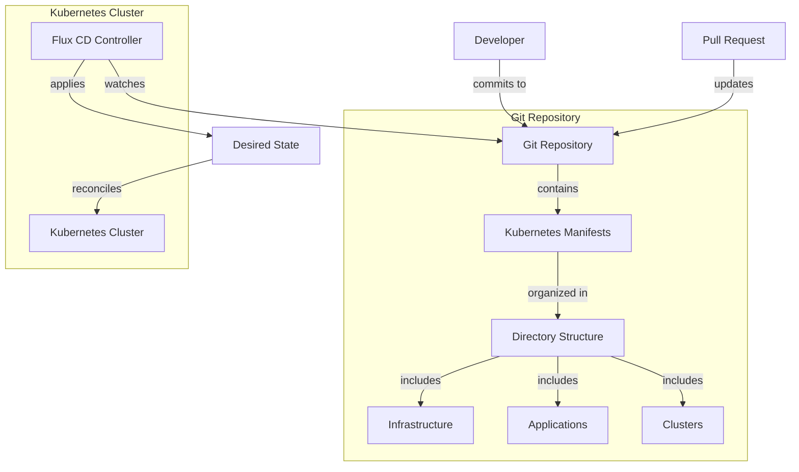

# GitOps Architecture

This document describes the architecture and workflow of the GitOps implementation using Flux CD for the Azure VMSS Kubernetes cluster.

## Architecture Diagram

## Component Description

### Flux CD Components
- **Source Controller**: Monitors Git repository for changes and fetches manifests
- **Kustomize Controller**: Processes Kustomization resources and applies them to the cluster
- **Helm Controller**: Handles Helm releases defined in the Git repository
- **Notification Controller**: Manages notifications and alerts for the GitOps workflow

### Directory Structure
- **Infrastructure**: Base components required for the cluster to function
  - Namespaces
  - CRDs
  - RBAC configurations
  - Network policies
- **Applications**: Workloads deployed on the cluster
  - Application deployments
  - Services
  - Ingress rules
  - ConfigMaps and Secrets
- **Clusters**: Environment-specific configurations
  - Development
  - Staging
  - Production

### GitOps Workflow
- **Reconciliation Loop**: Flux continuously monitors the Git repository for changes
- **Drift Detection**: Any deviation from the desired state is automatically corrected
- **Progressive Delivery**: Changes flow from development to production environments

### Data Flow
1. **Change Initiation**: Developer commits changes to the Git repository
2. **Detection**: Flux Source Controller detects changes in the repository
3. **Manifest Acquisition**: Updated manifests are fetched from the repository
4. **Validation**: Manifests are validated for correctness and compatibility
5. **Application**: Kustomize Controller applies the changes to the cluster
6. **Verification**: Changes are verified against the desired state
7. **Notification**: Status updates are sent to configured notification channels

### Security Considerations
- **Repository Security**: Access to the Git repository is controlled and audited
- **Manifest Validation**: Manifests are validated before application to the cluster
- **Secret Management**: Sensitive information is securely handled with appropriate tools
- **RBAC Integration**: Flux operates with the minimum required permissions
- **SSH Authentication**: Secure communications between Flux and Git repositories