# 🏗️ GitOps Architecture with Flux CD

## 📖 Overview

This GitOps container implements a comprehensive continuous delivery architecture using Flux CD for Kubernetes, following GitOps principles where Git serves as the single source of truth for both application manifests and infrastructure configuration. The architecture enables automated, auditable, and reversible deployments through declarative configuration management and pull-based delivery mechanisms.

The system demonstrates advanced GitOps patterns including progressive delivery, multi-environment promotion, configuration layering with Kustomize, and automated drift detection with reconciliation. This architecture represents the operational excellence layer that transforms declarative configurations into running applications within the Kubernetes cluster ecosystem.

---

## 🏛️ High-Level Architecture

```mermaid
graph TB
    subgraph "Developer Workspace"
        DEV[👨‍💻 Developer] 
        IDE[💻 IDE/VS Code]
        GIT_CLI[📱 Git CLI]
    end
    
    subgraph "Source Control"
        REPO[📂 Git Repository]
        APPS[📱 apps/]
        INFRA[🏗️ infrastructure/]
        CLUSTERS[🌐 clusters/]
    end
    
    subgraph "Flux Control Plane"
        SRC[🔍 Source Controller]
        KUST[⚙️ Kustomize Controller] 
        HELM[⛵ Helm Controller]
        NOTIF[📢 Notification Controller]
        IMG[🖼️ Image Automation Controller]
    end
    
    subgraph "Kubernetes Cluster"
        API[☸️ Kubernetes API]
        NODES[🖥️ Worker Nodes]
        
        subgraph "Workloads"
            NS1[📦 development]
            NS2[📦 staging] 
            NS3[📦 production]
            PODS[🚀 Application Pods]
        end
        
        subgraph "Infrastructure"
            RBAC[🔐 RBAC]
            NET[🌐 Network Policies]
            SECRETS[🔒 Secrets]
        end
    end
    
    subgraph "External Systems"
        MONITOR[📊 Monitoring]
        ALERTS[🚨 Alerting]
        REGISTRY[📦 Container Registry]
        VAULT[🔐 Key Vault]
    end
    
    DEV -->|commits| REPO
    IDE -->|push| REPO
    GIT_CLI -->|operations| REPO
    
    REPO --> APPS
    REPO --> INFRA  
    REPO --> CLUSTERS
    
    SRC -->|monitors| REPO
    SRC -->|fetches| KUST
    SRC -->|provides| HELM
    
    KUST -->|applies| API
    HELM -->|deploys| API
    NOTIF -->|alerts| MONITOR
    IMG -->|updates| REPO
    
    API --> NODES
    NODES --> NS1
    NODES --> NS2
    NODES --> NS3
    NODES --> PODS
    
    API --> RBAC
    API --> NET
    API --> SECRETS
    
    KUST -->|monitors| PODS
    HELM -->|manages| PODS
    NOTIF -->|sends| ALERTS
    
    SECRETS -.->|integrates| VAULT
    MONITOR -.->|scrapes| PODS
    PODS -.->|pulls from| REGISTRY
    
    classDef developer fill:#e1f5fe,stroke:#01579b
    classDef git fill:#f3e5f5,stroke:#4a148c  
    classDef flux fill:#fff3e0,stroke:#e65100
    classDef k8s fill:#e8f5e8,stroke:#1b5e20
    classDef external fill:#fce4ec,stroke:#880e4f
    
    class DEV,IDE,GIT_CLI developer
    class REPO,APPS,INFRA,CLUSTERS git
    class SRC,KUST,HELM,NOTIF,IMG flux
    class API,NODES,NS1,NS2,NS3,PODS,RBAC,NET,SECRETS k8s
    class MONITOR,ALERTS,REGISTRY,VAULT external
```



This comprehensive architecture illustrates the end-to-end GitOps pipeline, showing how developer commits flow through Flux controllers to orchestrate Kubernetes resources, with integrated monitoring, security, and external system interactions for production-ready deployment automation.

---

## 🧩 Core Components

### Flux Source Controller
- **Purpose**: Git repository monitoring and manifest fetching for continuous synchronization
- **Technology**: Flux CD v2 Source API, Git protocol, SSH/HTTPS authentication
- **Location**: `clusters/*/flux-system/`
- **Responsibilities**:
  - Monitor Git repository for configuration changes
  - Fetch and validate Kubernetes manifests and Kustomizations
  - Manage repository authentication and access credentials
  - Provide source artifacts for other Flux controllers
- **Interfaces**: Consumes Git repositories, provides manifests to Kustomize and Helm controllers

### Flux Kustomize Controller
- **Purpose**: Declarative configuration management and resource application to Kubernetes
- **Technology**: Kustomize v4+, Kubernetes API, YAML processing
- **Location**: `apps/*/kustomization.yaml`, `infrastructure/*/kustomization.yaml`
- **Responsibilities**:
  - Process Kustomization resources and apply configurations
  - Manage resource dependencies and application ordering
  - Perform health checks and status reporting
  - Handle configuration drift detection and automatic reconciliation
- **Interfaces**: Consumes manifests from Source Controller, applies resources to Kubernetes API

### Application Management Layer
- **Purpose**: Structured application deployment with environment-specific configuration
- **Technology**: Kustomize overlays, YAML manifests, Kubernetes resources
- **Location**: `apps/base/`, `apps/overlays/`
- **Responsibilities**:
  - Define base application configurations and common resources
  - Implement environment-specific patches and overrides
  - Manage application lifecycle and deployment strategies
  - Coordinate multi-application dependencies and ordering
- **Interfaces**: Provides structured manifests for Kustomize Controller processing

### Infrastructure Configuration
- **Purpose**: Core cluster infrastructure and platform services management
- **Technology**: Kubernetes manifests, RBAC, Network Policies, CRDs
- **Location**: `infrastructure/base/`, `infrastructure/overlays/`
- **Responsibilities**:
  - Deploy and manage cluster-wide infrastructure components
  - Configure namespaces, RBAC, and security policies
  - Manage Custom Resource Definitions and operators
  - Implement network policies and service mesh configurations
- **Interfaces**: Provides foundational resources for application deployment

### Environment Orchestration
- **Purpose**: Multi-environment deployment coordination and promotion workflows
- **Technology**: Environment-specific overlays, Git branching strategies
- **Location**: `clusters/development/`, `clusters/staging/`, `clusters/production/`
- **Responsibilities**:
  - Manage environment-specific configurations and policies
  - Coordinate deployment promotion across environments
  - Implement environment isolation and security boundaries
  - Handle environment-specific resource scaling and optimization
- **Interfaces**: Orchestrates application and infrastructure deployment per environment

### Secret Management Integration
- **Purpose**: Secure credential handling within GitOps workflows
- **Technology**: SOPS encryption, Kubernetes Secrets, Azure Key Vault (optional)
- **Location**: `*/secrets/`, encrypted YAML files
- **Responsibilities**:
  - Encrypt sensitive configuration data before Git storage
  - Integrate with external secret management systems
  - Manage secret rotation and lifecycle automation
  - Provide secure access to credentials for applications
- **Interfaces**: Provides encrypted secrets for application and infrastructure use

---

## 📊 Data Models & Schema


### Key Data Entities
- **Git Repository**: Source of truth containing all configuration manifests and policies
- **Kustomization**: Declarative configuration resource defining how manifests are applied
- **Environment**: Logical grouping of resources with specific policies and configurations
- **Overlay**: Environment-specific configuration patches and overrides
- **Flux Controllers**: Operational components managing GitOps workflow automation

### Relationships
- Git Repository → Kustomizations: Contains declarative configuration definitions
- Kustomization → Kubernetes Resources: Generates and manages cluster resources
- Environment → Overlays: Defines environment-specific configuration modifications
- Base Config → Overlays: Provides foundation for environment-specific customization

---

## 🔄 Data Flow & Interactions

```mermaid
sequenceDiagram
    participant DEV as 👨‍💻 Developer
    participant GIT as 📂 Git Repository
    participant SRC as 🔍 Source Controller
    participant KUST as ⚙️ Kustomize Controller
    participant HELM as ⛵ Helm Controller
    participant K8S as ☸️ Kubernetes API
    participant MON as 📊 Monitoring
    participant ALERT as 🚨 Alert Manager
    
    Note over DEV,ALERT: GitOps Deployment Workflow
    
    DEV->>+GIT: 1. Commit manifests
    GIT-->>-DEV: Commit confirmed
    
    Note over SRC: Continuous Monitoring
    SRC->>+GIT: 2. Poll for changes (every 5m)
    GIT-->>-SRC: Return manifest updates
    
    SRC->>+KUST: 3. Notify manifest update
    KUST->>+GIT: 4. Fetch Kustomization resources
    GIT-->>-KUST: Return configurations
    
    Note over KUST: Configuration Processing
    KUST->>+KUST: 5. Build and validate resources
    KUST->>+K8S: 6. Apply resources (dry-run first)
    K8S-->>-KUST: Validation result
    
    alt Validation Successful
        KUST->>+K8S: 7. Apply resources
        K8S-->>-KUST: Application status
        KUST->>+MON: 8. Report success
        MON-->>-KUST: Status recorded
    else Validation Failed
        KUST->>+ALERT: 8a. Send error alert
        ALERT-->>-KUST: Alert sent
    end
    
    Note over HELM: Helm Chart Management
    HELM->>+GIT: 9. Fetch Helm releases
    GIT-->>-HELM: Return release definitions
    HELM->>+K8S: 10. Deploy/Update releases
    K8S-->>-HELM: Release status
    
    Note over K8S,KUST: Drift Detection & Reconciliation
    K8S->>+KUST: 11. Resource drift detected
    KUST->>+K8S: 12. Reconcile to desired state
    K8S-->>-KUST: Reconciliation complete
    
    Note over MON: Health Monitoring
    MON->>+K8S: 13. Collect metrics
    K8S-->>-MON: Resource metrics
    
    alt Health Check Failed
        MON->>+ALERT: 14. Trigger alert
        ALERT->>+DEV: 15. Notify developer
        DEV-->>-ALERT: Acknowledgment
    end
    
    Note over DEV,ALERT: Complete GitOps Cycle
```



### Operational Characteristics

**Request/Response Flow:**
1. **Change Detection (5-minute intervals)**: Source Controller polls Git repository for manifest changes
2. **Manifest Processing**: Kustomize Controller fetches, validates, and builds configuration resources  
3. **Progressive Application**: Resources applied with dependency ordering and health validation
4. **Continuous Monitoring**: Health checks with automated drift detection and reconciliation
5. **Error Handling**: Comprehensive error reporting with alert integration and rollback capabilities

**Performance Metrics:**
- **Sync Interval**: 5 minutes (configurable per source)
- **Reconciliation**: 10 minutes (configurable per resource)
- **Health Check**: 30 seconds for readiness probes
- **Rollback Time**: < 60 seconds for automated reversion

---

## 🚀 Deployment & Environment

### Development Environment
- **Platform**: Kubernetes 1.24+ cluster with Flux CD v2 installed
- **Dependencies**: kubectl, flux CLI, git, kustomize, optional SOPS for secret management
- **Setup**: Git repository access with SSH keys or tokens, Flux bootstrap completed

### Production Considerations
- **Scalability**: Multi-cluster federation support, horizontal scaling of Flux controllers
- **Performance**: Efficient resource reconciliation with configurable sync intervals
- **Monitoring**: Comprehensive observability with Prometheus metrics and alert integration

### Configuration Management
- **Environment Variables**: Git repository URLs, authentication tokens, cluster configurations
- **Secrets**: SOPS-encrypted secrets, Kubernetes secret resources, external secret integration
- **Feature Flags**: Progressive delivery controls, environment-specific feature toggles

---

## 🔒 Security Architecture

### Authentication & Authorization
- **Authentication**: Git repository access via SSH keys or personal access tokens
- **Authorization**: Kubernetes RBAC for Flux service accounts and user access
- **Session Management**: Token rotation and secure credential storage in Kubernetes secrets

### Data Protection
- **Encryption**: SOPS encryption for sensitive data in Git, Kubernetes secrets encryption at rest
- **Input Validation**: Manifest validation and policy enforcement before application
- **Data Privacy**: Sensitive configuration isolated and encrypted throughout the pipeline

### Security Measures
- **Network Security**: Network policies for pod-to-pod communication control
- **Secret Management**: Encrypted storage and rotation of sensitive configuration data
- **Policy Enforcement**: OPA Gatekeeper integration for compliance and security policies

---

## ⚡ Error Handling & Resilience

### Error Management Strategy
- **Error Detection**: Continuous health monitoring and status reporting for all resources
- **Error Reporting**: Structured logging and alert integration with monitoring systems
- **Error Recovery**: Automatic reconciliation and rollback capabilities for failed deployments

### Resilience Patterns
- **Circuit Breaker**: Deployment health checks preventing cascade failures
- **Retry Logic**: Configurable retry intervals for transient failures and network issues
- **Health Checks**: Comprehensive resource health validation and drift detection

---

## 🎯 Design Decisions & Trade-offs

### Key Architectural Decisions
1. **Pull-Based vs Push-Based Delivery**
   - **Decision**: Implemented pull-based GitOps model with Flux CD
   - **Rationale**: Enhanced security, reduced external access requirements, simplified credential management
   - **Alternatives**: Push-based CI/CD, external deployment agents, direct kubectl access
   - **Trade-offs**: Slightly increased complexity for reduced security risk and improved automation

2. **Kustomize vs Helm for Configuration Management**
   - **Decision**: Primary use of Kustomize with optional Helm integration
   - **Rationale**: Declarative patching model, no templating complexity, native Kubernetes integration
   - **Alternatives**: Pure Helm, custom templating solutions, manual manifest management
   - **Trade-offs**: Limited templating capabilities for simplified configuration management

3. **Multi-Environment Repository Structure**
   - **Decision**: Monorepo with environment-specific overlays and cluster configurations
   - **Rationale**: Centralized configuration management, easier cross-environment promotion
   - **Alternatives**: Separate repositories per environment, branch-based environments
   - **Trade-offs**: Increased repository complexity for improved governance and consistency

### Known Limitations
- **Git Repository Dependency**: Single point of failure if Git repository becomes unavailable
- **Configuration Complexity**: Large-scale environments require sophisticated overlay management
- **Secret Management**: SOPS integration adds complexity for secret rotation and access

### Future Considerations
- **Multi-Cluster Federation**: Enhanced support for managing multiple Kubernetes clusters
- **Advanced Progressive Delivery**: Integration with service mesh for sophisticated traffic management
- **Policy as Code**: Enhanced integration with Open Policy Agent for comprehensive governance

---

## 📁 Directory Structure & Organization

```
gitops/
├── apps/                          # Application configurations
│   ├── base/                      # Base application manifests
│   │   ├── kustomization.yaml     # Base resource definitions
│   │   └── nginx/                 # Sample application
│   └── overlays/                  # Environment-specific overrides
│       ├── development/           # Development patches
│       ├── staging/               # Staging configuration
│       └── production/            # Production optimizations
├── infrastructure/                # Infrastructure components
│   ├── base/                      # Core infrastructure
│   │   ├── kustomization.yaml     # Infrastructure orchestration
│   │   ├── namespaces.yaml        # Namespace definitions
│   │   └── rbac/                  # Role-based access control
│   └── overlays/                  # Environment infrastructure
├── clusters/                      # Cluster-specific configurations
│   ├── development/               # Development cluster
│   ├── staging/                   # Staging cluster
│   └── production/                # Production cluster
├── scripts/                       # Automation utilities
│   ├── bootstrap.sh               # GitOps initialization
│   ├── sync.sh                    # Manual synchronization
│   └── validate.sh                # Configuration validation
└── README.md                      # Container documentation
```

### Organization Principles
- **Separation of Concerns**: Clear separation between applications, infrastructure, and cluster configurations
- **Environment Promotion**: Structured overlay pattern enabling configuration promotion across environments
- **Version Control**: Git-native organization supporting branching strategies and collaboration workflows

---

## 🔗 External Dependencies

| Dependency | Purpose | Version | Documentation |
|------------|---------|---------|---------------|
| Flux CD | GitOps continuous delivery | 2.0+ | [Flux Documentation](https://fluxcd.io/docs/) |
| Kubernetes | Container orchestration platform | 1.24+ | [Kubernetes Docs](https://kubernetes.io/docs/) |
| Kustomize | Configuration management | 4.0+ | [Kustomize Documentation](https://kustomize.io/) |
| SOPS | Secret encryption | 3.7+ | [SOPS GitHub](https://github.com/mozilla/sops) |
| Git | Version control system | 2.0+ | [Git Documentation](https://git-scm.com/doc) |
| OPA Gatekeeper | Policy enforcement | 3.10+ | [Gatekeeper Docs](https://open-policy-agent.github.io/gatekeeper/) |

---

## 📚 References
- [Project README](README.md)
- [Project Manifest](PROJECT-MANIFEST.md)
- [Parent Architecture](../ARCHITECTURE.md)
- [Ansible Integration](../ansible/README.md)
  - Network policies
- **Applications**: Workloads deployed on the cluster
  - Application deployments
  - Services
  - Ingress rules
  - ConfigMaps and Secrets
- **Clusters**: Environment-specific configurations
  - Development
  - Staging
  - Production

### GitOps Workflow
- **Reconciliation Loop**: Flux continuously monitors the Git repository for changes
- **Drift Detection**: Any deviation from the desired state is automatically corrected
- **Progressive Delivery**: Changes flow from development to production environments

### Data Flow
1. **Change Initiation**: Developer commits changes to the Git repository
2. **Detection**: Flux Source Controller detects changes in the repository
3. **Manifest Acquisition**: Updated manifests are fetched from the repository
4. **Validation**: Manifests are validated for correctness and compatibility
5. **Application**: Kustomize Controller applies the changes to the cluster
6. **Verification**: Changes are verified against the desired state
7. **Notification**: Status updates are sent to configured notification channels

### Security Considerations
- **Repository Security**: Access to the Git repository is controlled and audited
- **Manifest Validation**: Manifests are validated before application to the cluster
- **Secret Management**: Sensitive information is securely handled with appropriate tools
- **RBAC Integration**: Flux operates with the minimum required permissions
- **SSH Authentication**: Secure communications between Flux and Git repositories