# 📋 Project Manifest: GitOps Continuous Delivery with Flux CD

## 🎯 Project Identity
- **Name**: GitOps Continuous Delivery and Application Lifecycle Management
- **Type**: DevOps Automation & Platform Engineering Container
- **Scope**: GitOps Implementation, Progressive Delivery, Configuration Management
- **Curriculum Stage**: Advanced Platform Engineering
- **Duration**: 70-90 hours (comprehensive mastery including advanced delivery patterns)

---

## 🛠️ Technology Signature

### Core Technologies
- **Primary Language**: YAML for declarative configuration, Bash for automation scripting
- **Framework/Runtime**: Flux CD 2.0+ GitOps toolkit, Kubernetes 1.24+ platform
- **Version Requirements**: Flux CD ≥2.0, Kubernetes ≥1.24, Kustomize ≥4.0, Git ≥2.0

### Development Environment
- **Operating System**: Ubuntu 22.04 LTS, Windows 10/11 with WSL2, macOS Monterey+
- **Development Tools**: kubectl, flux CLI, VS Code with Kubernetes extension, Git client
- **Package Managers**: Kustomize for configuration management, Helm for package management

### Libraries & Dependencies
- **Core Libraries**: flux2 controllers, kustomize, sops (secret encryption), helm (package management)
- **Testing Libraries**: conftest (policy testing), kubeval (manifest validation), flux system tests
- **Build Tools**: kustomize build, flux CLI, yamllint (configuration validation), kubectl dry-run

### Code Standards
- **Style Guide**: Kubernetes resource conventions, GitOps best practices, YAML formatting standards
- **Documentation**: Inline YAML comments, comprehensive GitOps runbooks, architectural documentation
- **Linting**: yamllint for YAML quality, kubeval for manifest validation, flux validation checks

---

## 🎓 Demonstrated Competencies

### GitOps Engineering Skills
- **Advanced GitOps Architecture**: Comprehensive Flux CD implementation with multi-controller orchestration | *File: [clusters/*/flux-system/]*
  - Source, Kustomize, Helm, and Notification controller configuration
  - Git repository monitoring and automated synchronization patterns
  - Progressive delivery implementation with health checks and rollbacks
- **Declarative Configuration Management**: Complex Kubernetes manifest orchestration | *File: [apps/, infrastructure/]*
  - Multi-layer configuration with base and overlay patterns
  - Environment-specific configuration management and promotion
  - Resource dependency management and application ordering

### Progressive Delivery Patterns
- **Multi-Environment Deployment**: Structured deployment pipelines across environments | *File: [clusters/development/, clusters/staging/, clusters/production/]*
  - Environment isolation and configuration boundary management
  - Automated promotion workflows with validation gates
  - Environment-specific policy enforcement and compliance
- **Configuration Layering**: Advanced Kustomize patterns for scalable configuration | *File: [*/kustomization.yaml]*
  - Base configuration templates with environment overlays
  - Strategic merge patches and JSON patches for customization
  - Resource composition and dependency orchestration

### Application Lifecycle Management
- **Continuous Deployment**: Automated application delivery with GitOps workflows | *File: [apps/base/, apps/overlays/]*
  - Git-driven deployment automation with audit trails
  - Automated health monitoring and drift detection
  - Rollback capabilities and disaster recovery procedures
- **Infrastructure as Code**: Platform infrastructure management through GitOps | *File: [infrastructure/base/]*
  - Namespace management and RBAC configuration
  - Network policy implementation and security boundaries
  - Custom Resource Definition deployment and management

### Security & Compliance Integration
- **Secret Management**: Secure credential handling within GitOps workflows | *File: [*/secrets/]*
  - SOPS encryption integration for sensitive configuration data
  - Kubernetes secret lifecycle management and rotation
  - External secret provider integration patterns
- **Policy Enforcement**: Automated compliance and governance implementation | *File: [infrastructure/policies/]*
  - OPA Gatekeeper policy deployment and management
  - Network policy automation and security boundary enforcement
  - Resource quota and limit enforcement automation

### Platform Engineering
- **Observability Integration**: Monitoring and alerting within GitOps workflows | *File: [infrastructure/monitoring/]*
  - Prometheus metrics collection and alerting rules
  - Grafana dashboard deployment and configuration
  - Log aggregation and distributed tracing setup
- **Automation & Tooling**: Platform automation and developer experience enhancement | *File: [scripts/]*
  - GitOps bootstrap and initialization automation
  - Configuration validation and testing frameworks
  - Troubleshooting tools and operational procedures

### Software Engineering Practices
- **Version Control**: Advanced Git workflows for infrastructure and application management
- **Testing**: Configuration testing and validation strategies | *Tests: [scripts/validate.sh, conftest/]*
- **Documentation**: Comprehensive operational runbooks and architectural documentation
- **Debugging**: Systematic troubleshooting of complex distributed GitOps systems

### Problem-Solving Skills
- **System Design**: Scalable GitOps architecture with multi-cluster federation capabilities
- **Resource Optimization**: Efficient resource utilization and cost management strategies
- **Operational Excellence**: Comprehensive monitoring, alerting, and incident response procedures

---

## 🏗️ System Context

### Curriculum Integration
- **Prerequisites**: Strong Kubernetes fundamentals, Git workflow expertise, YAML configuration mastery
- **Builds Upon**: Container orchestration, infrastructure automation, CI/CD pipeline implementation
- **Prepares For**: Advanced platform engineering, multi-cloud orchestration, enterprise DevOps leadership

### Learning Pathway
- **Foundation Concepts**: GitOps principles, declarative configuration, pull-based delivery models
- **Advanced Concepts**: Progressive delivery patterns, multi-environment orchestration, policy as code
- **Practical Applications**: Production platform management, developer self-service, compliance automation

### Project Relationships
- **Related Projects**: Kubernetes administration, infrastructure automation, monitoring and observability
- **Dependencies**: Kubernetes cluster with Flux CD installed (via Ansible configuration management)
- **Extensions**: Advanced deployment strategies, multi-cluster federation, service mesh integration

---

## 💻 Development Requirements

### System Prerequisites
- **Operating System**: Ubuntu 22.04 LTS or compatible Linux distribution, Windows 10/11, macOS Monterey+
- **Memory**: 8GB+ RAM for development environment, adequate for kubectl and flux CLI operations
- **Storage**: 30GB+ available disk space for repositories, manifests, and development tools
- **Network**: Reliable internet connectivity for Git repository access and Kubernetes API communication

### Software Dependencies
- **Compilers/Interpreters**: No compilation required (YAML interpreted by Kubernetes API)
- **Development Tools**: kubectl 1.24+, flux CLI 2.0+, Git 2.0+, kustomize 4.0+, code editor with YAML support
- **Package Managers**: Package management through Kubernetes manifests and Helm charts
- **Version Control**: Git with repository hosting (GitHub, GitLab, Azure DevOps) for GitOps workflows

### Environment Setup
1. **Kubernetes Access**: Configure kubectl with cluster access and appropriate RBAC permissions
2. **Flux Installation**: Verify Flux CD installation and controller availability in cluster
3. **Git Repository**: Initialize GitOps repository with proper directory structure and access permissions
4. **Development Tools**: Install flux CLI, kustomize, and configure Git authentication

---

## 🔄 Development Workflow

### Project Initialization
1. **GitOps Repository Setup**: Initialize repository structure with proper directory organization
2. **Flux Bootstrap**: Configure Flux CD controllers and establish Git repository monitoring
3. **Environment Configuration**: Set up development, staging, and production environment structures

### Development Cycle
1. **Planning**: Design application deployment strategy and define configuration requirements
2. **Implementation**: Develop Kubernetes manifests using declarative configuration patterns
3. **Testing**: Validate configurations using dry-run, kubeval, and flux validation tools
4. **Documentation**: Update deployment procedures and operational runbooks
5. **Review**: Conduct peer review focusing on security, performance, and operational excellence

### Quality Assurance
- **Code Style**: Automated validation with yamllint and Kubernetes manifest best practices
- **Testing Protocol**: Configuration testing with conftest, kubeval, and integration validation
- **Documentation Standards**: Comprehensive operational procedures and troubleshooting guides
- **Peer Review**: Collaborative review process emphasizing security and platform reliability

---

## 🎯 Learning Outcomes

### Technical Mastery
By completing this project, learners will master:
- **Advanced GitOps Engineering**: Production-ready Flux CD implementation with multi-controller orchestration
- **Progressive Delivery**: Sophisticated deployment strategies with automated health checks and rollbacks
- **Configuration Management**: Complex Kubernetes manifest organization and environment promotion
- **Platform Automation**: Comprehensive automation of application and infrastructure lifecycle management

### Conceptual Understanding
- **GitOps Principles**: Deep understanding of pull-based delivery and declarative configuration management
- **Platform Engineering**: Comprehensive platform design and developer experience optimization
- **Security Integration**: Advanced security patterns within GitOps workflows and automation
- **Operational Excellence**: Production-ready operational procedures and incident response capabilities

### Practical Skills
- **Kubernetes Mastery**: Advanced Kubernetes resource management and cluster administration
- **Automation Expertise**: Sophisticated automation development and platform engineering
- **Troubleshooting Proficiency**: Systematic debugging of complex distributed GitOps systems
- **Collaboration Skills**: Effective team collaboration within GitOps and platform engineering contexts

---

## 📊 Assessment Criteria

### Comprehensive Evaluation Framework

#### GitOps Implementation Excellence (Weight: 35%)

| 🎯 Assessment Area | 📋 Evaluation Criteria | 🏆 Mastery Indicators |
|-------------------|-------------------------|------------------------|
| **Flux CD Architecture** | Multi-controller setup, source management, reconciliation | All controllers operational, automated sync, drift detection |
| **Configuration Management** | Kustomize patterns, overlay structure, environment promotion | Scalable overlay hierarchy, clean separation of concerns |
| **Progressive Delivery** | Deployment strategies, health checks, automated rollbacks | Zero-downtime deployments, intelligent rollback triggers |
| **Security Integration** | SOPS encryption, RBAC, policy enforcement | End-to-end secret management, comprehensive access control |

#### Technical Implementation Quality (Weight: 40%)

| 🔧 Technical Domain | 📈 Evaluation Metrics | ✅ Success Criteria |
|--------------------|------------------------|---------------------|
| **Manifest Quality** | YAML structure, resource organization, documentation | Clean, validated manifests with comprehensive comments |
| **Automation Sophistication** | Script quality, error handling, operational procedures | Robust automation with comprehensive error handling |
| **Performance Optimization** | Resource efficiency, reconciliation speed, scalability | Optimized sync intervals, efficient resource utilization |
| **Monitoring Integration** | Observability setup, alerting configuration, dashboards | Complete monitoring stack with actionable alerts |

#### Platform Engineering Mastery (Weight: 25%)

| 🚀 Platform Capability | 🎯 Assessment Focus | 📊 Measurement Approach |
|------------------------|---------------------|-------------------------|
| **Developer Experience** | Self-service capabilities, documentation quality, onboarding | Comprehensive docs, streamlined deployment workflows |
| **Operational Excellence** | Troubleshooting procedures, incident response, maintenance | Well-documented runbooks, proactive monitoring |
| **Scalability Planning** | Multi-cluster readiness, performance considerations | Architecture supports horizontal scaling |
| **Innovation Integration** | Advanced features, emerging patterns, tool integration | Implementation of cutting-edge GitOps patterns |

### Competency Assessment Matrix

#### Foundation Level (Required Baseline)
- [ ] **Basic GitOps Understanding**: Demonstrates comprehension of GitOps principles and pull-based delivery
- [ ] **Kubernetes Proficiency**: Shows mastery of Kubernetes resources and manifest management
- [ ] **Git Workflow Expertise**: Implements proper Git branching and collaboration strategies
- [ ] **Configuration Management**: Uses Kustomize effectively for environment-specific configurations

#### Advanced Level (Target Achievement) 
- [ ] **Multi-Environment Orchestration**: Successfully implements promotion pipelines across environments
- [ ] **Security Best Practices**: Integrates comprehensive security measures throughout the pipeline
- [ ] **Automation Excellence**: Develops sophisticated automation with error handling and monitoring
- [ ] **Performance Optimization**: Implements efficient resource management and scaling strategies

#### Expert Level (Exceptional Mastery)
- [ ] **Platform Innovation**: Contributes novel solutions and advanced GitOps patterns
- [ ] **Architectural Leadership**: Designs scalable, maintainable GitOps architectures
- [ ] **Community Contribution**: Shares knowledge and contributes to GitOps ecosystem
- [ ] **Enterprise Readiness**: Implements production-grade solutions with enterprise considerations

### Practical Assessment Deliverables

#### Core Infrastructure (Mandatory)
- [ ] **Flux CD Installation**: Complete multi-controller setup with proper configuration
- [ ] **Repository Structure**: Well-organized GitOps repository following best practices
- [ ] **Environment Management**: Multi-environment setup with proper isolation and promotion
- [ ] **Application Deployment**: Functional application deployment with health monitoring

#### Advanced Features (Enhanced Evaluation)
- [ ] **Progressive Delivery**: Implementation of advanced deployment patterns
- [ ] **Secret Management**: Comprehensive secret handling with encryption and rotation
- [ ] **Policy Enforcement**: Automated compliance and governance implementation
- [ ] **Monitoring Integration**: Complete observability stack with alerting and dashboards

#### Excellence Indicators (Distinguished Performance)
- [ ] **Documentation Quality**: Comprehensive, professional documentation with examples
- [ ] **Operational Procedures**: Well-defined runbooks and troubleshooting guides  
- [ ] **Innovation Elements**: Implementation of advanced or emerging GitOps patterns
- [ ] **Knowledge Transfer**: Effective knowledge sharing and mentoring capabilities

---

## 🛠️ Implementation Mapping

### Implementation Mapping

| 📁 Component | 🎯 Core Technology | 💡 Primary Skill | 🏆 Learning Outcome |
|--------------|-------------------|------------------|----------------------|
| **Flux Control Plane** | Flux CD 2.0+ | Advanced GitOps Architecture | Master production-ready continuous delivery orchestration |
| **Source Management** | Git + SSH/HTTPS | Repository Integration | Implement secure, automated configuration synchronization |
| **Configuration Processing** | Kustomize 4.0+ | Declarative Management | Develop sophisticated environment-specific configuration patterns |
| **Application Delivery** | Kubernetes 1.24+ | Progressive Deployment | Execute advanced deployment strategies with health validation |
| **Secret Management** | SOPS + Kubernetes Secrets | Security Integration | Implement secure credential lifecycle within GitOps workflows |
| **Policy Enforcement** | OPA Gatekeeper | Compliance Automation | Establish automated governance and regulatory compliance |
| **Observability** | Prometheus + Grafana | Platform Monitoring | Build comprehensive monitoring and alerting capabilities |

### Advanced Skills Matrix

| 🚀 GitOps Pattern | 💻 Implementation | � File Reference | 🎓 Competency Level |
|-------------------|-------------------|-------------------|---------------------|
| **Multi-Environment Promotion** | Environment-specific overlays with validation gates | `apps/overlays/*/` | Advanced |
| **Progressive Delivery** | Automated rollout with health checks and rollback | `clusters/*/kustomizations/` | Expert |
| **Configuration Layering** | Hierarchical Kustomize patterns with inheritance | `*/kustomization.yaml` | Advanced |
| **Drift Detection** | Automated reconciliation with conflict resolution | Flux controller configs | Advanced |
| **Secret Lifecycle** | Encrypted storage with automated rotation | `*/secrets/` | Expert |
| **Policy as Code** | Automated compliance validation and enforcement | `infrastructure/policies/` | Advanced |
| **Infrastructure Automation** | Declarative platform service management | `infrastructure/base/` | Expert |
| **Monitoring Integration** | Comprehensive observability with alert automation | `infrastructure/monitoring/` | Advanced |

### Skill Progression Pathway

```mermaid
graph LR
    A[📚 Foundation] --> B[🛠️ Implementation]
    B --> C[🚀 Optimization]
    C --> D[🎯 Mastery]
    
    subgraph "Foundation Phase"
        A1[GitOps Principles]
        A2[Kubernetes Fundamentals]
        A3[YAML Configuration]
        A4[Git Workflows]
    end
    
    subgraph "Implementation Phase"
        B1[Flux CD Setup]
        B2[Kustomize Patterns]
        B3[Environment Promotion]
        B4[Basic Automation]
    end
    
    subgraph "Optimization Phase"
        C1[Progressive Delivery]
        C2[Security Integration]
        C3[Policy Enforcement]
        C4[Advanced Monitoring]
    end
    
    subgraph "Mastery Phase"
        D1[Multi-Cluster Federation]
        D2[Platform Engineering]
        D3[Disaster Recovery]
        D4[Performance Optimization]
    end
    
    A --> A1
    A --> A2
    A --> A3
    A --> A4
    
    B --> B1
    B --> B2
    B --> B3
    B --> B4
    
    C --> C1
    C --> C2
    C --> C3
    C --> C4
    
    D --> D1
    D --> D2
    D --> D3
    D --> D4
```

---

## 📚 Resources & References

### Required Reading
- [Flux CD Documentation](https://fluxcd.io/docs/) - Comprehensive GitOps implementation guide
- [GitOps Principles](https://www.gitops.tech/) - Foundational GitOps concepts and practices

### Supplementary Materials
- [Kustomize Tutorial](https://kustomize.io/tutorial/) - Configuration management and environment promotion
- [Kubernetes Security Best Practices](https://kubernetes.io/docs/concepts/security/) - Security implementation patterns

### Tools & Documentation
- [SOPS Documentation](https://github.com/mozilla/sops) - Secret encryption and management
- [OPA Gatekeeper Guide](https://open-policy-agent.github.io/gatekeeper/) - Policy enforcement and compliance

### Related Projects
- [Parent Repository](../README.md) - Complete infrastructure automation suite
- [Architecture Documentation](../ARCHITECTURE.md) - System-wide architectural overview
- [Ansible Integration](../ansible/README.md) - Configuration management foundation

---

## 🔧 Maintenance Notes

### Code Conventions
- **Naming**: Resource names follow Kubernetes conventions with environment prefixes
- **Structure**: Logical organization with clear separation between applications and infrastructure
- **Comments**: YAML comments explain complex configurations and deployment strategies

### Update Procedures
- **Version Updates**: Regular updates to Flux CD controllers and Kubernetes resource versions
- **Feature Additions**: Incremental additions following GitOps principles and pull request workflows
- **Bug Fixes**: Systematic issue tracking and resolution through Git-based collaboration

### Troubleshooting
- **Common Issues**: Configuration drift, synchronization failures, authentication problems
- **Debug Strategies**: Flux CLI debugging, kubectl resource inspection, log analysis procedures
- **Support Resources**: Community forums, official documentation, enterprise platform support

## Implementation Specifics

### Directory Structure
- **infrastructure/**: [Base cluster components](./infrastructure/)
- **applications/**: [Application workloads](./applications/)
- **clusters/**: [Environment-specific configurations](./clusters/)

### Deployment Pipelines
- **Source Controller**: Git repository synchronization
- **Kustomize Controller**: Manifest application
- **Helm Controller**: Chart deployments
- **Notification Controller**: Alerting and events

### Security Features
- **RBAC Definitions**: [infrastructure/rbac/](./infrastructure/rbac/)
- **Network Policies**: [infrastructure/networking/](./infrastructure/networking/)
- **Secret Management**: SOPS integration with Key Vault
