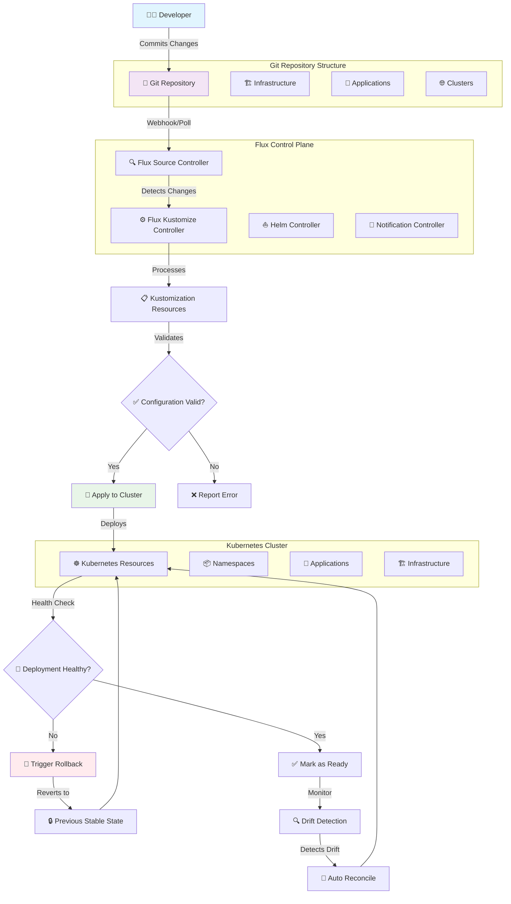

<p align="center">
  
  
  
  
  
</p>

<div align="center">
  <h1>🔄 GitOps Continuous Delivery</h1>
  <p><em>Production-ready GitOps implementation with Flux CD for declarative Kubernetes application deployment</em></p>
</div>

---

## 📋 Table of Contents
- [📖 Overview](#-overview)
- [🎯 Learning Objectives](#-learning-objectives)
- [🛠️ Tech Stack](#️-tech-stack)
- [📁 Project Structure](#-project-structure)
- [🚀 Getting Started](#-getting-started)
- [💡 Usage](#-usage)
- [🏆 Key Features](#-key-features)
- [🔧 GitOps Workflow](#-gitops-workflow)
- [👥 Contributors](#-contributors)

## 📖 Overview

This GitOps container provides a comprehensive, production-ready continuous delivery solution using Flux CD for Kubernetes application deployment and infrastructure management. It implements GitOps principles where Git serves as the single source of truth for both application manifests and infrastructure configuration, enabling automated, auditable, and reversible deployments.

The solution demonstrates advanced GitOps patterns including progressive delivery, multi-environment promotion, configuration layering with Kustomize, and automated drift detection with reconciliation. This container represents the operational layer that transforms declarative configurations into running applications within the Kubernetes cluster.

## 🎯 Learning Objectives

Through this GitOps implementation, you will master:

- **Advanced GitOps Architecture**: Flux CD implementation with declarative application delivery
- **Kubernetes Manifest Management**: Complex resource orchestration and dependency management
- **Progressive Delivery Patterns**: Automated deployment strategies with rollback capabilities
- **Configuration Layering**: Kustomize-based environment-specific configuration management
- **Drift Detection & Reconciliation**: Automated state monitoring and correction mechanisms
- **Multi-Environment Promotion**: Structured deployment pipelines across development stages
- **Secret Management Integration**: Secure credential handling within GitOps workflows
- **Policy Enforcement**: Automated compliance and security policy implementation

## 🛠️ Tech Stack

**Core Technologies:**
- **Flux CD 2.0+**: GitOps continuous delivery operator for Kubernetes
- **Kubernetes 1.24+**: Container orchestration platform with declarative API
- **Kustomize**: Configuration management and environment overlay system

**GitOps Tools:**
- **Git**: Version control and source of truth for configurations
- **SOPS**: Secret encryption for secure credential management
- **Helm**: Package management for complex applications (optional)
- **OPA Gatekeeper**: Policy enforcement and compliance automation

**Development Tools:**
- **kubectl**: Kubernetes command-line interface for cluster interaction
- **kustomize**: Configuration building and environment management
- **flux CLI**: Flux-specific operations and troubleshooting

## 📁 Project Structure

```
gitops/
├── README.md                      # Container documentation
├── .repo-context.json            # Metadata and configuration
├── ARCHITECTURE.md               # GitOps architecture guide
├── PROJECT-MANIFEST.md           # Learning objectives and assessment
├── apps/                          # Application configurations
│   ├── base/                      # Base application manifests
│   │   ├── kustomization.yaml     # Base kustomization definition
│   │   └── nginx/                 # Sample nginx application
│   └── overlays/                  # Environment-specific overrides
│       ├── development/           # Development environment config
│       ├── staging/               # Staging environment config
│       └── production/            # Production environment config
├── infrastructure/                # Infrastructure components
│   ├── base/                      # Base infrastructure manifests
│   │   ├── kustomization.yaml     # Infrastructure kustomization
│   │   ├── namespaces.yaml        # Namespace definitions
│   │   └── rbac/                  # Role-based access control
│   └── overlays/                  # Environment-specific infrastructure
├── clusters/                      # Cluster-specific configurations
│   ├── development/               # Development cluster config
│   ├── staging/                   # Staging cluster config
│   └── production/                # Production cluster config
└── scripts/                       # Automation and utility scripts
    ├── bootstrap.sh               # Initial GitOps setup
    ├── sync.sh                    # Manual synchronization
    └── validate.sh                # Configuration validation
```

## 🚀 Getting Started

### Prerequisites

- **Kubernetes Cluster** with Flux CD installed (via Ansible container)
- **Git Repository** access with SSH keys or personal access tokens
- **kubectl** configured for cluster access
- **Flux CLI** installed for GitOps operations

### Quick Setup

1. **Verify Flux Installation**
```bash
flux check --pre
flux get sources git
```

2. **Clone GitOps Repository**
```bash
git clone <repository-url>
cd azure_vmss_cluster/gitops
```

3. **Bootstrap GitOps Repository** (if not done by Ansible)
```bash
flux bootstrap git \
  --url=<git-repo-url> \
  --branch=main \
  --path=clusters/development
```

4. **Verify Flux Controllers**
```bash
flux get kustomizations
flux get helmreleases
```

5. **Monitor Initial Deployment**
```bash
watch kubectl get pods -A
flux logs --follow
```

## 💡 Usage

### Application Deployment

```bash
# Deploy new application
cd apps/base
mkdir my-app
cat <<EOF > my-app/deployment.yaml
# Application manifest
EOF

# Add to kustomization
echo "  - my-app" >> kustomization.yaml

# Commit and push
git add . && git commit -m "Add my-app" && git push
```

### Environment-Specific Configuration

```bash
# Create environment overlay
cd apps/overlays/production
cat <<EOF > kustomization.yaml
apiVersion: kustomize.config.k8s.io/v1beta1
kind: Kustomization
resources:
  - ../../base
patchesStrategicMerge:
  - production-patches.yaml
EOF
```

### Secret Management

```bash
# Encrypt secrets with SOPS
kubectl create secret generic api-key \
  --from-literal=key=secret-value \
  --dry-run=client -o yaml | \
  sops --encrypt --in-place /dev/stdin > secret.yaml
```

### Manual Synchronization

```bash
# Force reconciliation
flux reconcile source git gitops-repo
flux reconcile kustomization infrastructure
flux reconcile kustomization apps
```

## 🏆 Key Features

### 🔄 **Advanced GitOps Architecture**
- **🎯 Git as Single Source of Truth**: Complete cluster state defined in Git with immutable audit trail and version control
- **🔄 Automated Reconciliation**: Continuous monitoring with intelligent drift detection and automatic correction mechanisms  
- **📥 Pull-Based Delivery**: Secure deployment model with cluster-initiated updates eliminating external access requirements
- **⏮️ Intelligent Rollback**: Automated reversion to stable configurations based on health checks and deployment validation

### 🚀 **Progressive Delivery Excellence**
- **🐤 Canary Deployments**: Sophisticated gradual rollout with automated health validation and traffic management
- **🔵🟢 Blue-Green Strategies**: Zero-downtime deployment patterns with instant switchover and rollback capabilities
- **🎛️ Feature Flag Integration**: Configuration-driven feature enablement with environment-specific activation controls
- **📊 Health-Based Automation**: Intelligent deployment decisions based on comprehensive application and infrastructure metrics

### 🔧 **Enterprise Configuration Management**
- **📋 Kustomize Integration**: Hierarchical configuration layering with inheritance patterns and strategic merge capabilities
- **⛵ Helm Chart Support**: Advanced package management for complex applications with lifecycle automation
- **🌍 Multi-Environment Excellence**: Sophisticated development, staging, and production pipeline with promotion automation
- **🏢 Namespace Federation**: Secure multi-tenant cluster resource segregation with policy-based isolation

### 🔐 **Security & Compliance Framework**
- **🔒 SOPS Secret Encryption**: Military-grade secret management with Git-compatible encryption and rotation automation
- **👤 Advanced RBAC**: Comprehensive role-based access control for GitOps operations with principle of least privilege
- **📜 Policy as Code**: Automated compliance validation using OPA Gatekeeper with real-time policy enforcement
- **📋 Complete Audit Trail**: Immutable deployment history with compliance reporting and change attribution

### 📊 **Operational Intelligence**
- **📈 Prometheus Integration**: Native metrics collection with custom GitOps-specific monitoring and performance indicators
- **📊 Grafana Dashboards**: Real-time visualization of deployment health, resource utilization, and operational metrics
- **🚨 Intelligent Alerting**: Context-aware notifications with severity-based routing and automated escalation procedures
- **🔍 Distributed Tracing**: End-to-end request tracking across GitOps workflow and application deployment lifecycle

## 🔧 GitOps Workflow



This enhanced workflow visualizes the complete GitOps lifecycle from developer commit to production deployment, showcasing automated validation, health monitoring, and intelligent rollback capabilities with Flux CD's declarative orchestration.

## 👥 Contributors

<div align="center">

| Role | Contributor | Contact |
|------|-------------|---------|
| **GitOps Architect** | Chigbu Joshua | [GitHub Profile](https://github.com/jukwamike) |
| **DevOps Engineer** | Chigbu Joshua | [LinkedIn](https://linkedin.com/in/chigbu-joshua) |
| **Platform Engineer** | Chigbu Joshua | [Email](mailto:chigbujoshua@gmail.com) |

</div>

---

<div align="center">
  <p><strong>🚀 Ready to implement GitOps?</strong></p>
  <p><em>This GitOps container provides production-ready continuous delivery for Kubernetes</em></p>
  
  **[📖 Architecture Guide](ARCHITECTURE.md)** • **[📋 Project Manifest](PROJECT-MANIFEST.md)** • **[🔗 Parent Project](../README.md)**
</div>
