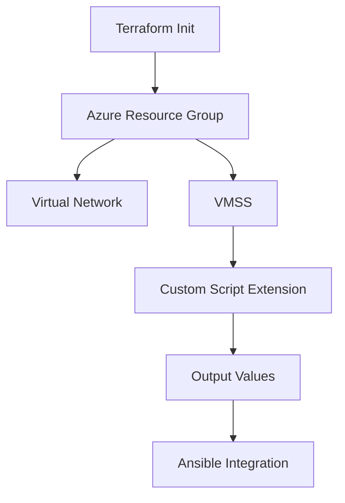

# Terraform Component Architecture

## Component Purpose
The Terraform component is responsible for infrastructure provisioning within the VMSS Cluster solution.

## Design Decisions
- Uses modular approach to separate networking, compute, and security concerns
- State stored in Azure Storage for team collaboration
- Variables structured to support multiple environments

## Component Diagram

## Input/Output Flows
- **Inputs**: Variable files, Service Principal credentials
- **Outputs**: Azure resources, terraform_outputs.json

## Key Files
- **main.tf**: Primary resource definitions
- **variables.tf**: Input variable declarations
- **outputs.tf**: Output variable declarations
- **modules/**: Reusable infrastructure components