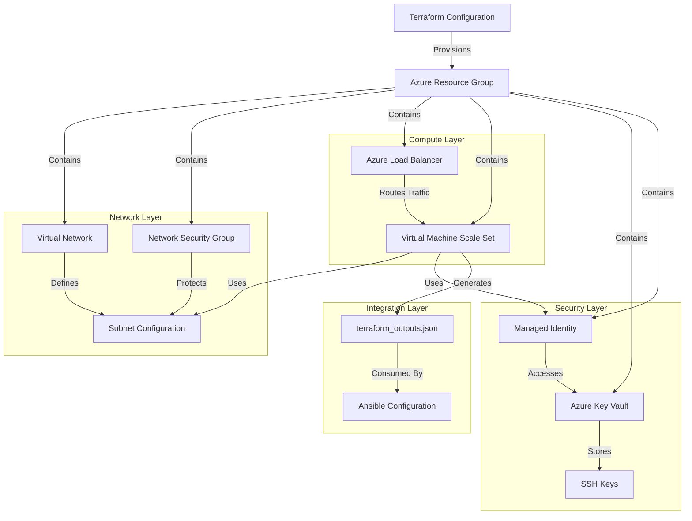
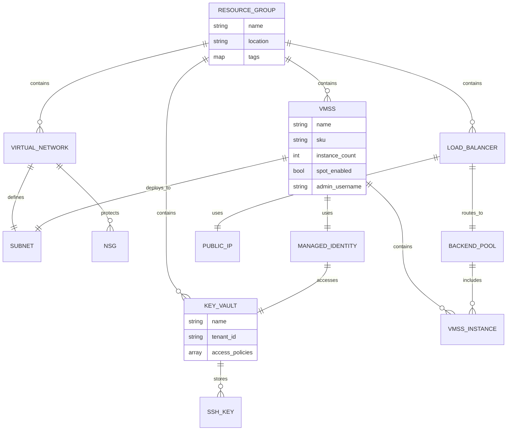
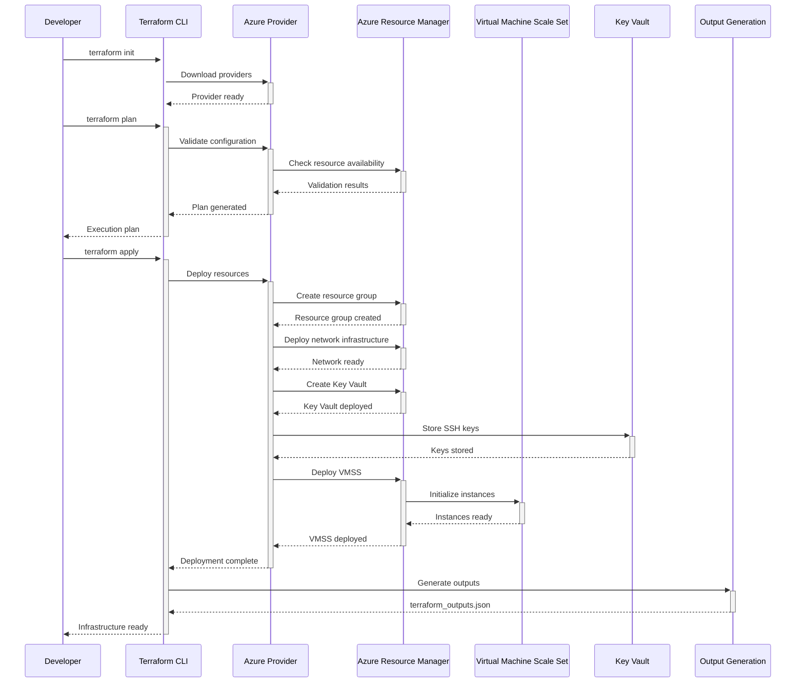

# 🏗️ Terraform Infrastructure Architecture

## 📖 Overview

This Terraform infrastructure container implements a comprehensive Infrastructure as Code (IaC) solution for provisioning production-ready Azure Virtual Machine Scale Set (VMSS) clusters optimized for Kubernetes workloads. The architecture follows Azure Well-Architected Framework principles, emphasizing security, reliability, performance efficiency, cost optimization, and operational excellence.

The infrastructure serves as the foundational layer in a multi-tier DevOps automation stack, creating all required Azure resources and generating structured outputs for seamless integration with downstream configuration management tools. This approach ensures reproducible, scalable, and maintainable infrastructure deployments across multiple environments.

---

## 🏛️ High-Level Architecture



The architecture implements a layered approach with clear separation of concerns: Network Layer provides isolation and security boundaries, Compute Layer delivers scalable processing capabilities, Security Layer ensures secure access and credential management, and Integration Layer enables seamless DevOps workflow integration.

---

## 🧩 Core Components

### Resource Group Management
- **Purpose**: Centralized resource organization and lifecycle management for all infrastructure components
- **Technology**: Azure Resource Manager, Terraform azurerm provider
- **Location**: `main.tf` (lines 13-19)
- **Responsibilities**:
  - Dynamic resource group creation with consistent naming conventions
  - Location-based resource deployment coordination
  - Resource lifecycle and dependency management
  - Cost center and billing organization
- **Interfaces**: Provides resource group context for all subsequent Azure resources

### Virtual Network Architecture
- **Purpose**: Network isolation, security boundaries, and connectivity management for VMSS infrastructure
- **Technology**: Azure Virtual Network, Network Security Groups, Subnet configuration
- **Location**: `main.tf` (lines 25-55)
- **Responsibilities**:
  - VNet creation with configurable address space
  - Subnet definition and IP address management
  - Network security group configuration and rule enforcement
  - Traffic filtering and access control implementation
- **Interfaces**: Provides network context for compute resources and load balancer integration

### Virtual Machine Scale Set
- **Purpose**: Auto-scaling compute infrastructure optimized for Kubernetes node deployment
- **Technology**: Azure VMSS, Ubuntu 22.04 LTS, Spot instances, Custom script extensions
- **Location**: `main.tf` (lines 100-180)
- **Responsibilities**:
  - Scalable compute resource provisioning with auto-scaling capabilities
  - Cost-optimized deployment using spot instance pricing
  - Custom script extension for initial configuration
  - Integration with load balancer for traffic distribution
  - Managed identity assignment for secure service access
- **Interfaces**: Consumes network configuration, integrates with load balancer and Key Vault

### Load Balancer Configuration
- **Purpose**: High availability and traffic distribution for VMSS instances
- **Technology**: Azure Load Balancer, Public IP, Backend pools, Health probes
- **Location**: `main.tf` (lines 60-100)
- **Responsibilities**:
  - Public IP allocation and DNS configuration
  - Load balancing rule configuration for HTTP/HTTPS traffic
  - Backend pool management for VMSS integration
  - Health probe configuration for instance monitoring
- **Interfaces**: Routes external traffic to VMSS instances, integrates with public networking

### Security & Identity Management
- **Purpose**: Secure credential management and service-to-service authentication
- **Technology**: Azure Key Vault, Managed Identity, SSH key automation
- **Location**: `ssh.tf`, `main.tf` (identity sections)
- **Responsibilities**:
  - Automated SSH key pair generation and storage
  - Azure Key Vault deployment with access policies
  - System-assigned managed identity configuration
  - RBAC role assignments for secure resource access
- **Interfaces**: Provides secure authentication for VMSS instances and downstream automation

### Configuration Management
- **Purpose**: Flexible infrastructure configuration and environment adaptability
- **Technology**: Terraform variables, outputs, provider configuration
- **Location**: `variables.tf`, `outputs.tf`, `providers.tf`
- **Responsibilities**:
  - Input variable validation and default value management
  - Structured output generation for downstream integration
  - Provider version constraints and feature configuration
  - Backend state management and collaboration
- **Interfaces**: Accepts configuration inputs, exports infrastructure metadata

---

## 📊 Data Models & Schema



### Key Data Entities
- **Resource Group**: Container for all infrastructure resources with lifecycle management
- **Virtual Network**: Network isolation boundary with subnet and security configuration
- **VMSS**: Scalable compute platform with auto-scaling and cost optimization features
- **Load Balancer**: Traffic distribution mechanism with health monitoring capabilities
- **Key Vault**: Secure storage for SSH keys and sensitive configuration data

### Relationships
- Resource Group → All Resources: Hierarchical containment and management
- VMSS → Network: Deployment within secure network boundaries
- Load Balancer → VMSS: Traffic routing and high availability configuration
- Managed Identity → Key Vault: Secure, passwordless authentication patterns

---

## 🔄 Data Flow & Interactions



### Request/Response Flow
1. **Initialization**: Terraform downloads and configures Azure provider with authentication
2. **Planning**: Configuration validation and execution plan generation with resource dependency analysis
3. **Resource Creation**: Sequential deployment following dependency hierarchy (network → security → compute)
4. **Configuration**: SSH key generation, Key Vault storage, and managed identity assignment
5. **Output Generation**: Structured metadata export for downstream Ansible integration

---

## 🚀 Deployment & Environment

### Development Environment
- **Platform**: Ubuntu 22.04 LTS or Windows 10/11 with WSL2, macOS Monterey+
- **Dependencies**: Terraform 1.0+, Azure CLI 2.0+, Git 2.0+, VS Code with Terraform extension
- **Setup**: Azure subscription with Contributor permissions, service principal authentication

### Production Considerations
- **Scalability**: VMSS auto-scaling with configurable min/max instances, load balancer scaling
- **Performance**: Spot instance optimization, SSD storage, optimized VM sizes
- **Monitoring**: Azure Monitor integration, resource health checks, cost monitoring alerts

### Configuration Management
- **Environment Variables**: Azure credentials (via service principal), subscription configuration
- **Secrets**: Service principal secrets, SSH private keys stored in Key Vault
- **Feature Flags**: Spot instance enablement, auto-scaling parameters, network configuration options

---

## 🔒 Security Architecture

### Authentication & Authorization
- **Authentication**: Azure service principal for Terraform operations, managed identity for VMSS
- **Authorization**: RBAC with least privilege principles, Key Vault access policies
- **Session Management**: Token-based authentication with automatic renewal, secure credential storage

### Data Protection
- **Encryption**: SSH keys encrypted at rest in Key Vault, network traffic encryption in transit
- **Input Validation**: Terraform variable validation, resource naming constraints
- **Data Privacy**: Sensitive outputs marked as sensitive, no credentials in state files

### Security Measures
- **Network Security**: NSG rules limiting access to required ports, subnet isolation
- **Identity Management**: System-assigned managed identities, RBAC role assignments
- **Secret Management**: Azure Key Vault integration with access logging and rotation capabilities

---

## ⚡ Error Handling & Resilience

### Error Management Strategy
- **Error Detection**: Terraform validation, Azure provider error reporting, resource deployment monitoring
- **Error Reporting**: Detailed error messages with resource context, troubleshooting guidance
- **Error Recovery**: Idempotent resource operations, automatic retry for transient failures

### Resilience Patterns
- **Circuit Breaker**: Provider timeout configuration preventing infinite hangs
- **Retry Logic**: Automatic retry for rate-limited or temporarily unavailable services
- **Health Checks**: Resource validation and dependency verification during deployment

---

## 🎯 Design Decisions & Trade-offs

### Key Architectural Decisions
1. **Monolithic vs Modular Configuration**
   - **Decision**: Single main.tf with logical resource grouping
   - **Rationale**: Simplified dependency management and reduced complexity for educational purposes
   - **Alternatives**: Module-based architecture, separate configuration files per service
   - **Trade-offs**: Reduced modularity for improved readability and maintainability

2. **Spot Instance Configuration**
   - **Decision**: Enabled spot instances for cost optimization with eviction handling
   - **Rationale**: Significant cost reduction (up to 90%) suitable for development/testing workloads
   - **Alternatives**: Standard pricing, reserved instances, dedicated hosts
   - **Trade-offs**: Potential interruption risk for substantial cost savings

3. **State Management Approach**
   - **Decision**: Local state with optional remote backend configuration
   - **Rationale**: Simplified setup for learning while supporting team collaboration patterns
   - **Alternatives**: Mandatory remote state, Terraform Cloud integration
   - **Trade-offs**: Initial simplicity with migration path to enterprise patterns

### Known Limitations
- **Single Region Deployment**: Current configuration supports single Azure region deployment
- **Fixed VM Size**: VMSS uses predefined VM size without dynamic sizing capabilities
- **Limited Auto-scaling**: Basic auto-scaling configuration without advanced metrics integration

### Future Considerations
- **Multi-Region Support**: Cross-region deployment capabilities with global load balancing
- **Advanced Monitoring**: Integration with Azure Monitor, Application Insights, and Log Analytics
- **Blue-Green Deployments**: Advanced deployment strategies for zero-downtime updates

---

## 📁 Directory Structure & Organization

```
terraform/
├── main.tf                     # Primary infrastructure resources
├── variables.tf               # Input variable definitions
├── outputs.tf                 # Output variable declarations
├── providers.tf               # Provider configuration
├── ssh.tf                     # SSH key generation and Key Vault integration
├── terraform_outputs.json     # Generated outputs for Ansible
├── main.tfplan                # Cached execution plan
├── scripts/                   # Automation and utility scripts
│   └── deployment_scripts/    # Deployment automation tools
├── README.md                  # Container documentation
├── ARCHITECTURE.md           # Architecture documentation
├── PROJECT-MANIFEST.md       # Learning objectives and assessment
└── .repo-context.json        # Metadata and configuration
```

### Organization Principles
- **Resource Grouping**: Logical organization by Azure service type and dependency hierarchy
- **Configuration Separation**: Clear separation between resource definitions, variables, and outputs
- **Documentation Colocation**: Architecture and learning documentation alongside code

---

## 🔗 External Dependencies

| Dependency | Purpose | Version | Documentation |
|------------|---------|---------|---------------|
| Terraform | Infrastructure orchestration | 1.0+ | [Terraform Docs](https://developer.hashicorp.com/terraform/docs) |
| Azure Provider | Azure resource management | 3.0+ | [Azure Provider](https://registry.terraform.io/providers/hashicorp/azurerm/latest/docs) |
| Azure CLI | Azure API interaction | 2.0+ | [Azure CLI Reference](https://docs.microsoft.com/en-us/cli/azure/) |
| Random Provider | Resource naming randomization | 3.0+ | [Random Provider](https://registry.terraform.io/providers/hashicorp/random/latest/docs) |
| Azure Resource Manager | Azure service orchestration | N/A | [ARM Documentation](https://docs.microsoft.com/en-us/azure/azure-resource-manager/) |

---

## 📚 References
- [Project README](README.md)
- [Project Manifest](PROJECT-MANIFEST.md)
- [Parent Architecture](../ARCHITECTURE.md)
- [Ansible Integration](../ansible/README.md)