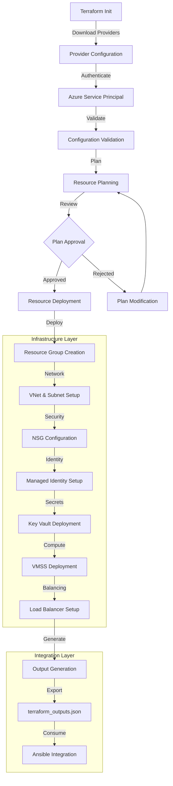

<p align="center">
  
  
  
  
  
</p>

<div align="center">
  <h1>🏗️ Terraform Infrastructure Management</h1>
  <p><em>Production-ready Azure VMSS infrastructure provisioning for Kubernetes cluster deployment</em></p>
</div>

---

## 📋 Table of Contents
- [📖 Overview](#-overview)
- [🎯 Learning Objectives](#-learning-objectives)
- [🛠️ Tech Stack](#️-tech-stack)
- [📁 Project Structure](#-project-structure)
- [🚀 Getting Started](#-getting-started)
- [💡 Usage](#-usage)
- [🏆 Key Features](#-key-features)
- [🔧 Infrastructure Workflow](#-infrastructure-workflow)
- [👥 Contributors](#-contributors)

## 📖 Overview

This Terraform infrastructure container provides enterprise-grade Infrastructure as Code (IaC) for deploying Azure Virtual Machine Scale Set (VMSS) clusters optimized for Kubernetes workloads. It implements advanced Azure networking patterns, security best practices, and automated resource provisioning with comprehensive state management.

The infrastructure forms the foundation layer of a complete DevOps automation stack, provisioning all required Azure resources and generating structured outputs consumed by downstream Ansible configuration management. This approach ensures reproducible, scalable, and maintainable infrastructure deployments across multiple environments.

## 🎯 Learning Objectives

Through this infrastructure implementation, you will master:

- **Advanced Terraform Architecture**: Modular IaC design with complex resource dependencies
- **Azure Resource Management**: Comprehensive VMSS, networking, and security resource provisioning
- **Infrastructure Security**: Managed identities, Key Vault integration, and network security implementation
- **State Management**: Remote state storage with locking and collaboration patterns
- **Output Integration**: Structured data export for multi-tool DevOps workflows
- **Network Architecture**: VNet design, peering, and security group configuration
- **Auto-scaling Configuration**: VMSS deployment with spot instances and load balancing
- **Resource Optimization**: Cost-effective infrastructure patterns and resource tagging

## 🛠️ Tech Stack

**Core Technologies:**
- **Terraform 1.0+**: Infrastructure as Code orchestration and state management
- **Azure Provider 3.0+**: Azure resource provisioning and management
- **HCL (HashiCorp Configuration Language)**: Declarative infrastructure definition

**Azure Services:**
- **Virtual Machine Scale Sets**: Auto-scaling compute infrastructure
- **Azure Load Balancer**: Traffic distribution and high availability
- **Virtual Network (VNet)**: Network isolation and security boundaries
- **Azure Key Vault**: Secure credential and secret management
- **Network Security Groups**: Firewall rules and traffic control
- **Managed Identity**: Secure service-to-service authentication

**Development Tools:**
- **Azure CLI**: Azure API interaction and authentication
- **Terraform CLI**: Infrastructure deployment and state management
- **Azure Storage**: Remote state backend with locking capabilities

## 📁 Project Structure

```
terraform/
├── README.md                    # Container documentation
├── .repo-context.json          # Metadata and configuration
├── ARCHITECTURE.md             # Infrastructure architecture guide
├── PROJECT-MANIFEST.md         # Learning objectives and assessment
├── main.tf                     # Primary resource definitions
├── variables.tf                # Input variable declarations
├── outputs.tf                  # Output variable definitions
├── providers.tf                # Provider configuration
├── ssh.tf                      # SSH key management resources
├── terraform_outputs.json      # Generated outputs for Ansible
├── main.tfplan                 # Execution plan cache
└── scripts/                    # Automation and helper scripts
    └── deployment_scripts/     # Deployment automation tools
```

## 🚀 Getting Started

### Prerequisites

- **Azure Subscription** with Contributor permissions
- **Azure CLI** 2.0+ installed and authenticated
- **Terraform** 1.0+ installed locally
- **Storage Account** configured for remote state (recommended)

### Quick Setup

1. **Clone Repository & Navigate**
```bash
cd /path/to/azure_vmss_cluster/terraform
```

2. **Configure Azure Authentication**
```bash
az login
az account set --subscription "your-subscription-id"
```

3. **Initialize Terraform**
```bash
terraform init
```

4. **Review Configuration**
```bash
# Validate configuration
terraform validate

# Check formatting
terraform fmt -check
```

5. **Deploy Infrastructure**
```bash
# Create execution plan
terraform plan -out=main.tfplan

# Apply infrastructure changes
terraform apply main.tfplan
```

## 💡 Usage

### Basic Deployment

```bash
# Initialize and deploy with default settings
terraform init
terraform plan -out=main.tfplan
terraform apply main.tfplan
```

### Custom Configuration

```bash
# Deploy with custom variables
terraform plan -var="resource_group_location=eastus" \
               -var="username=customadmin" \
               -out=main.tfplan
terraform apply main.tfplan
```

### Environment-Specific Deployment

```bash
# Use variable files for different environments
terraform plan -var-file="environments/production.tfvars" -out=main.tfplan
terraform apply main.tfplan
```

### Output Integration

```bash
# Generate outputs for Ansible integration
terraform output -json > terraform_outputs.json

# Verify specific outputs
terraform output vmss_name
terraform output key_vault_name
```

## 🏆 Key Features

### 🔐 **Enterprise Security**
- **Managed Identity Integration**: System-assigned identities for secure resource access
- **Azure Key Vault**: Automated SSH key generation and secure storage
- **Network Security Groups**: Comprehensive firewall rules and access controls
- **RBAC Integration**: Role-based access control for resource management

### 🚀 **Scalable Architecture**
- **Virtual Machine Scale Sets**: Auto-scaling compute infrastructure with spot instances
- **Load Balancer Integration**: High availability with traffic distribution
- **VNet Peering Ready**: Network architecture supporting complex topologies
- **Resource Tagging**: Comprehensive metadata for cost management and governance

### 🔧 **Advanced Configuration**
- **Modular Design**: Reusable components with clear separation of concerns
- **Variable Management**: Flexible configuration supporting multiple environments
- **State Management**: Remote backend with locking for team collaboration
- **Output Generation**: Structured data export for downstream automation

### 📊 **Operational Excellence**
- **Infrastructure Validation**: Built-in validation and formatting checks
- **Documentation**: Comprehensive inline documentation and external guides
- **Error Handling**: Robust error detection and recovery mechanisms
- **Cost Optimization**: Spot instance configuration and resource efficiency

## 🔧 Infrastructure Workflow



This workflow demonstrates the systematic approach to infrastructure provisioning, from initial configuration through deployment to downstream integration with configuration management tools.

## 👥 Contributors

<div align="center">

| Role | Contributor | Contact |
|------|-------------|---------|
| **Infrastructure Architect** | Chigbu Joshua | [GitHub Profile](https://github.com/jukwamike) |
| **DevOps Engineer** | Chigbu Joshua | [LinkedIn](https://linkedin.com/in/chigbu-joshua) |
| **Cloud Solutions Expert** | Chigbu Joshua | [Email](mailto:chigbujoshua@gmail.com) |

</div>

---

<div align="center">
  <p><strong>🚀 Ready to scale your infrastructure?</strong></p>
  <p><em>This Terraform container provides the foundation for enterprise-grade Azure VMSS deployments</em></p>
  
  **[📖 Architecture Guide](ARCHITECTURE.md)** • **[📋 Project Manifest](PROJECT-MANIFEST.md)** • **[🔗 Parent Project](../README.md)**
</div>
terraform output -json > terraform_outputs.json
```

## Output Artifacts

The `terraform_outputs.json` file contains critical information including:
- Resource group name
- VMSS name
- Key Vault name
- Secret names for SSH keys

This output is consumed by the Ansible configuration to dynamically build inventory.

## Demonstrated Competencies

- Azure IaC Deployment
- Managed Identity Configuration
- Virtual Network Security Design
- Resource Scaling Architecture
- Infrastructure State Management
- SSH Key Automation